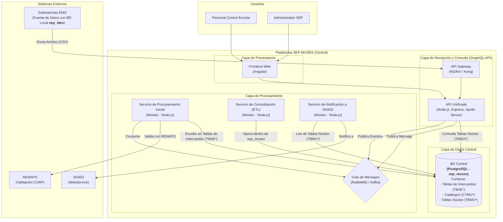

# Arquitectura de Componentes

## 1. Introducción
Este documento detalla la arquitectura de componentes de alto nivel para el sistema **Matrícula Única de Educación Superior (SEP-MUSES)**. El objetivo es descomponer el sistema en sus principales bloques lógicos y tecnológicos, y describir las responsabilidades e interacciones de cada uno.

## 2. Diagrama de Arquitectura

El siguiente diagrama muestra los componentes principales del sistema y cómo se relacionan entre sí, reflejando una única base de datos central (`sep_muses`) que gestiona todo el ciclo de vida de los datos.

### 2.1. Explicación de la Arquitectura y Flujo de Datos

La arquitectura está diseñada para ser escalable y desacoplada. La base de datos `sep_ides` existe en los subsistemas locales, mientras que `sep_muses` es la única base de datos centralizada.

#### Flujo de Recepción y Consolidación de Datos

1.  **Recepción:** Los **Sistemas Externos**, desde su base de datos local `sep_ides`, generan y envían un archivo **CSV** al **API Gateway** de la plataforma SEP-MUSES.
2.  **Encolamiento:** El gateway redirige la petición al **API de Recepción**, que valida la estructura del archivo y publica un mensaje en la **Cola de Mensajes** para su procesamiento asíncrono.
3.  **Procesamiento y Almacenamiento Inicial:** Un **Servicio de Procesamiento Inicial** consume el mensaje. Realiza validaciones externas (ej. CURP vs RENAPO) y almacena los datos crudos del archivo en las **Tablas de Intercambio (`TBAE*`)** dentro de la **BD Central (`sep_muses`)**.
4.  **Consolidación (ETL):** De forma periódica, el **Servicio de Consolidación (ETL)** se activa y opera enteramente dentro de `sep_muses`. Lee los datos de las tablas `TBAE*`, los valida contra los **Catálogos (`CTMU*`)**, aplica reglas de negocio, y finalmente inserta la información limpia y normalizada en las **Tablas Núcleo (`TBMU*`)**.
5.  **Notificación a SIGED:** Una vez que los datos están consolidados en las tablas `TBMU*`, el **Servicio de Notificación a SIGED** los lee y los envía al **WebService de SIGED**.

## 3. Descripción de Componentes

| Componente | Tecnología Sugerida | Responsabilidades |
|---|---|---|
| **API Gateway** | NGINX, Kong | Punto único de entrada. Gestiona el tráfico, la seguridad (TLS) y el enrutamiento. |
| **API Unificada (GraphQL)**| Node.js, Express, Apollo Server | Expone el API para la carga de archivos y las consultas de datos. Publica eventos en la Cola de Mensajes. |
| **Cola de Mensajes** | RabbitMQ, Kafka | Desacopla la recepción del procesamiento. Encola los eventos para ser procesados de forma asíncrona. |
| **Servicio de Procesamiento Inicial**| Worker (Node.js) | Consume mensajes de la cola. Realiza validaciones primarias y escribe los datos crudos en las **Tablas de Intercambio (`TBAE*`)** de la BD Central. |
| **Servicio de Consolidación (ETL)**| Worker (Node.js) | Opera dentro de `sep_muses` para validar datos de las tablas `TBAE*` contra los catálogos `CTMU*` y consolidarlos en las tablas núcleo `TBMU*`. |
| **Servicio de Notificación a SIGED**| Worker (Node.js) | Lee eventos consolidados de las tablas `TBMU*` y los reporta al WebService de SIGED. |
| **BD Central (`sep_muses`)** | PostgreSQL | Única base de datos central. Contiene las **Tablas de Intercambio (`TBAE*`)**, los **Catálogos (`CTMU*`)** para validación, y las **Tablas Núcleo (`TBMU*`)** con los datos consolidados. |
| **Frontend Web** | Angular | Aplicación web para los usuarios finales. |
