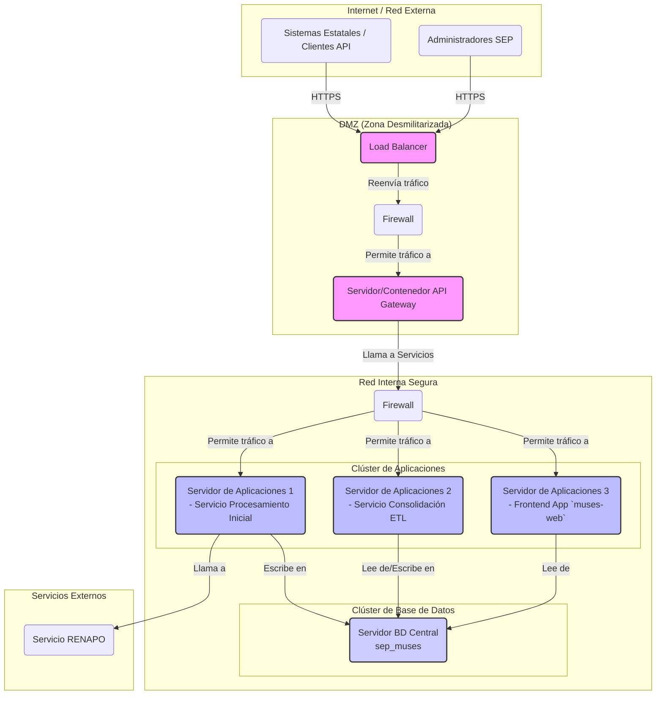

# Arquitectura Física (On-Premise)

## Diagrama de Despliegue Físico

## Descripción de la Infraestructura

1.  **Zona Desmilitarizada (DMZ):**
    *   **Load Balancer:** Distribuye el tráfico entrante.
    *   **Firewall (FW1):** Primera capa de seguridad.
    *   **Servidor del API Gateway:** Punto de entrada para todas las peticiones.

2.  **Red Interna Segura:**
    *   **Firewall (FW2):** Segunda capa de seguridad que aísla la red de aplicaciones y datos.
    *   **Clúster de Aplicaciones:** Conjunto de servidores donde se ejecutan los microservicios y la interfaz de usuario.
    *   **Clúster de Base de Datos:** Servidores dedicados para la base de datos central `sep_muses`. Se recomienda una configuración con replicación para alta disponibilidad y backups.

3.  **Conectividad Externa:**
    *   El tráfico de los **Sistemas Estatales** y de los **Administradores de la SEP** llega a través de internet.
    *   Las llamadas a servicios externos como **RENAPO** se originan desde los servidores de aplicaciones.
