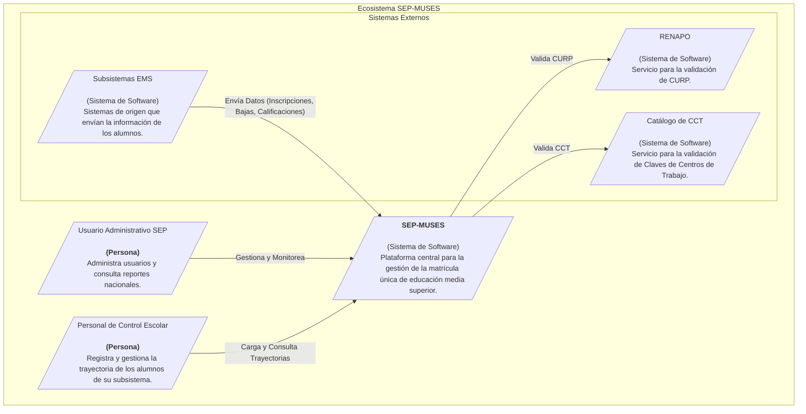

# Diagrama de Contexto del Sistema (C4)

## 1. Introducción

Este documento presenta el Diagrama de Contexto (Nivel 1 del Modelo C4) para el sistema **Matrícula Única de Educación Superior (SEP-MUSES)**.

El propósito de este diagrama es mostrar una vista de alto nivel del sistema, identificando a sus usuarios principales y las interacciones clave con otros sistemas externos. No detalla la tecnología ni la arquitectura interna, sino que se enfoca en el ecosistema en el que reside el sistema.

## 2. Diagrama de Contexto

## 3. Descripción de Componentes

| Nombre | Tipo | Descripción |
|---|---|---|
| **Usuario Administrativo SEP** | Persona | Rol dentro de la SEP con permisos para administrar la plataforma, gestionar usuarios y consultar estadísticas a nivel nacional. |
| **Personal de Control Escolar**| Persona | Usuario operativo en cada subsistema educativo, responsable de registrar y mantener actualizada la información de la trayectoria de los alumnos. |
| **SEP-MUSES** | Sistema | La plataforma de software que se está construyendo. Centraliza la información académica, valida los datos y ofrece servicios de consulta. |
| **RENAPO** | Sistema Externo | Registro Nacional de Población. Es el sistema gubernamental utilizado para validar la autenticidad y corrección de las claves CURP. |
| **Catálogo de CCT** | Sistema Externo | Sistema oficial de la SEP que contiene el catálogo de todas las Claves de Centros de Trabajo válidas en el país. |
| **Subsistemas EMS** | Sistema Externo | Representa los diversos sistemas de gestión escolar de las instituciones de Educación Media Superior (ej. DGETI, CONALEP, etc.) que actuarán como fuentes de datos para SEP-MUSES. |