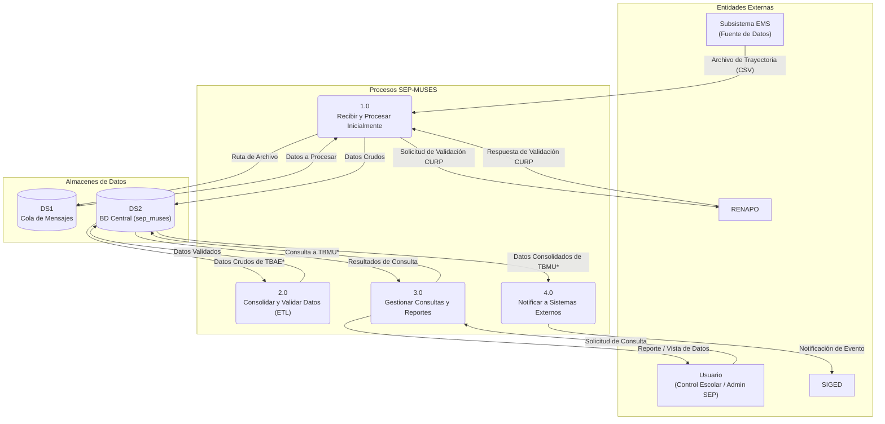

# Diagrama de Flujo de Datos (DFD)

## 1. Introducción

Este documento presenta el Diagrama de Flujo de Datos (DFD) de Nivel 0 para el sistema **Matrícula Única de Educación Superior (SEP-MUSES)**. El DFD se enfoca en cómo se mueve la información a través del sistema, identificando los procesos principales que transforman los datos, los almacenes de datos donde reside la información y las entidades externas que interactúan con el sistema.

## 2. Diagrama de Flujo de Datos - Nivel 0

## 3. Descripción de los Flujos

1.  **Recepción y Procesamiento Inicial:**
    *   Un **Subsistema Externo** envía un archivo **CSV** al proceso **1.0 Recibir y Procesar Inicialmente**.
    *   Este proceso utiliza una **Cola de Mensajes (DS1)** para gestionar la carga de forma asíncrona.
    *   Realiza validaciones externas consultando a **RENAPO** y almacena los datos crudos en las tablas de intercambio (`TBAE*`) de la **BD Central (DS2)**.

2.  **Consolidación y Validación (ETL):**
    *   El proceso **2.0 Consolidar y Validar Datos** opera enteramente dentro de la **BD Central (DS2)**.
    *   Lee los datos de las tablas de intercambio, los valida contra los catálogos internos (`CTMU*`) y los transforma.
    *   Guarda los datos limpios y normalizados en las tablas núcleo (`TBMU*`).

3.  **Consultas y Reportes:**
    *   Un **Usuario** solicita información a través del proceso **3.0 Gestionar Consultas y Reportes**.
    *   Este proceso consulta las tablas núcleo (`TBMU*`) de la **BD Central (DS2)** y devuelve los resultados al usuario.

4.  **Notificación a Sistemas Externos:**
    *   El proceso **4.0 Notificar a Sistemas Externos** lee datos consolidados de las tablas núcleo (`TBMU*`) en la **BD Central (DS2)**.
    *   Envía la información requerida a entidades externas como **SIGED**.
