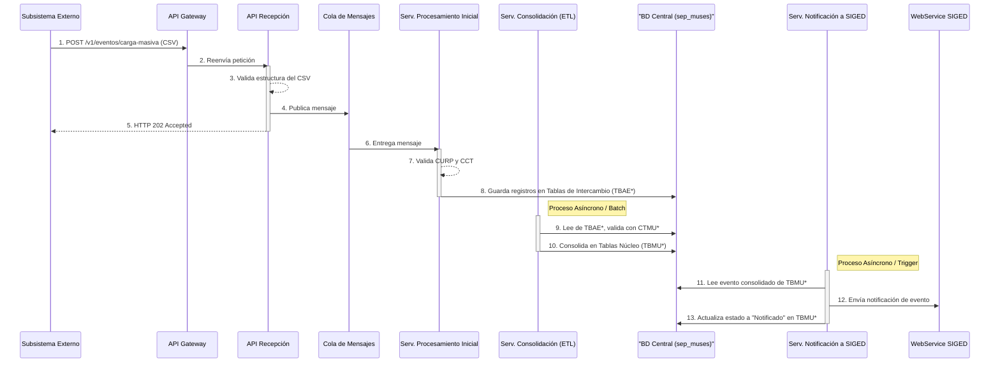

# Diagramas de Secuencia de Flujos de Trabajo Clave

## 1. Propósito

Este documento contiene diagramas de secuencia en formato Mermaid que ilustran los flujos de trabajo más importantes del sistema SEP-MUSES, alineados con la arquitectura de base de datos centralizada.

---

## 2. Flujo de Carga Masiva de Eventos y Notificación

Este diagrama muestra la secuencia de interacciones desde que un subsistema envía un archivo CSV hasta que la información es consolidada en la base de datos central `sep_muses` y notificada a SIGED.

### 2.1. Descripción del Flujo

El flujo de trabajo es asíncrono y se desarrolla de la siguiente manera:

1.  **Recepción y Acuse (Pasos 1-6):**
    *   Un **Subsistema Externo** (que utiliza su propia BD local `sep_ides`) envía un archivo **CSV** al **API Gateway**.
    *   El **API de Recepción** valida la estructura del archivo y publica un mensaje en la **Cola de Mensajes**.
    *   Se devuelve un acuse de recibo (`HTTP 202 Accepted`) al subsistema.

2.  **Procesamiento y Almacenamiento en Staging (Pasos 7-9):**
    *   El **Servicio de Procesamiento Inicial** consume el mensaje.
    *   Realiza validaciones externas (ej. CURP vs RENAPO).
    *   Guarda los registros del archivo en las **Tablas de Intercambio (TBAE*)** dentro de la **BD Central (`sep_muses`)**.

3.  **Consolidación ETL Interna (Pasos 10-12):**
    *   El **Servicio de Consolidación (ETL)** se ejecuta de forma programada.
    *   Lee los registros de las tablas `TBAE*` dentro de `sep_muses`.
    *   Los valida contra los **Catálogos (CTMU*)** y los transforma.
    *   Guarda los datos consolidados en las **Tablas Núcleo (TBMU*)** dentro de la misma `sep_muses`.

4.  **Notificación a SIGED (Pasos 13-15):**
    *   El **Servicio de Notificación a SIGED** lee los eventos consolidados de las tablas `TBMU*`.
    *   Envía la notificación al **WebService de SIGED**.
    *   Actualiza el estado del registro a "Notificado" en las tablas `TBMU*`.

