# Diseño Detallado: Diagrama Entidad-Relación (E-R)

## 1. Introducción

Este documento presenta el diagrama Entidad-Relación (E-R) para la base de datos consolidada del sistema **Matrí­cula Única de Educación Superior (SEP-MUSES)**, correspondiente al esquema `sep_muses`.

El diagrama ilustra el flujo de datos interno, mostrando cómo la información es recibida en las tablas de **Staging** (`tbae*`), y posteriormente procesada y normalizada en las tablas **Núcleo** (`tbmu*`), las cuales se apoyan en un conjunto de **Catálogos** (`ctmu*`).

## 2. Diagrama E-R del Esquema Consolidado (`sep_muses`)

```mermaid
erDiagram
    subgraph "Tablas de Staging (tbae*)"
        tbae001_inscripcion {
            string uuid PK "UUID de la transacción"
            int id_subsistema "ID del subsistema"
            string matricula_alumno "Matrícula en el subsistema"
            string curp_actual "CURP del alumno"
            string cct "Clave del Centro de Trabajo"
            int id_estatus_procesamiento "FK a ctmu011_estatus_procesamiento"
        }

        tbae002_bajas {
            string uuid PK "UUID de la transacción"
            int id_subsistema "ID del subsistema"
            string matricula_alumno "Matrícula en el subsistema"
            string curp "CURP del alumno"
            int id_estatus_procesamiento "FK a ctmu011_estatus_procesamiento"
        }

        tbae009_respuesta {
            int id_respuesta PK
            string uuid FK "UUID de la transacción"
            int id_estatus_procesamiento "Estado final del procesamiento"
        }

        tbae010_error {
            int id_error PK
            int id_respuesta FK
            int id_motivo_error "FK a ctmu008_motivo_error"
        }
    end

    subgraph "Tablas Núcleo"
        tbmu002_persona {
            int id_persona PK
            int id_entidad_federativa_n FK
            varchar(18) curp
            varchar(16) segmento_raiz
            varchar(13) rfc
            varchar(50) nombre
            varchar(50) primer_apellido
            varchar(50) segundo_apellido
            int id_sexo FK
            char(1) activo
        }
        tbmu020_alumno {
            int id_alumno PK "FK to tbmu002_persona"
            char(1) tiene_discapacidad
            int id_discapacidad FK
            int id_estado_civil FK
            char(1) indigena
            int id_lengua_materna FK
            int id_segunda_lengua FK
            char(1) minoria
            char(1) afrodescendiente
            varchar(150) beca_academica
            varchar(150) beca_deportiva
            char(1) apoyo_social
            int id_aptitud_sobresal FK
            char(1) activo
        }
        tbmu022_domicilio_persona {
            int id_domicilio PK
            int id_persona FK
            int id_localidad FK
            varchar(100) domicilio
            varchar(5) codigo_postal
            char(1) activo
        }
        tbmu003_correo {
            int id_tipo_correo PK "FK"
            int id_persona PK "FK"
            varchar(150) correo
            char(1) activo
        }
        tbmu004_telefono {
            int id_tipo_telefono PK "FK"
            int id_persona PK "FK"
            varchar(20) telefono
            char(1) activo
        }
        tbmu005_curp_historica {
            int id_curp_historica PK
            int id_persona PK "FK"
            varchar(18) curp
            char(1) activo
        }
        tbmu014_rfc_historico {
            int id_rfc_historico PK
            int id_persona FK
            varchar(13) rfc
            char(1) activo
        }
        tbmu008_institucion_academica {
            int id_institucion PK
            varchar(250) nombre_institucion
            char(1) activo
        }
        tbmu007_programa_academico {
            int id_programa_academico PK
            int id_competencia FK
            int id_periodicidad FK
            varchar(150) cve_programa_academico
            varchar(150) descripcion_programa_academico
            varchar(150) total_creditos
            char(1) activo
        }
        tbmu009_programa_institucion {
            int id_programa_institucion PK
            int id_programa_academico FK
            int id_institucion FK
            int id_opcion_educativa FK
            char(1) activo
        }
        tbmu006_inscripcion {
            int id_inscripcion PK
            int id_alumno FK
            int id_padre_tutor
            int id_programa_institucion FK
            int id_estatus_inscripcion FK
            int id_tipo_periodo FK
            varchar(10) cct
            timestamp fecha_inscripcion
            int id_origen_estudios FK
            timestamp fecha_inicio_ems
            int id_tipo_documento FK
            varchar(150) folio_certificado
            varchar(10) cct_procedencia
            varchar(150) promedio_certificado
            varchar(150) situacion_academica
            varchar(150) miembro_grupo_escolar
            int id_ciclo_escolar FK
            int id_grado FK
            int id_turno FK
            varchar(150) promedio_acumulado_ems
            varchar(150) creditos_acumulados_ems
            int id_subsistema FK
            char(1) activo
        }
        tbmu013_bajas {
            int id_baja PK
            int id_persona FK
            int id_motivo_baja FK
            int id_subsistema FK
            int id_programa_institucion FK
            varchar(50) tipo_baja
            timestamp fecha_baja
            varchar(20) cct
            char(1) activo
        }
        tbmu010_asignaturas {
            int id_asignatura PK
            varchar(150) cve_asignatura
            varchar(150) nombre_asignatura
            char(1) activo
        }
        tbmu012_programa_asignatura {
            int id_programa_asignatura PK
            int id_programa_academico FK
            int id_asignatura FK
            varchar(150) horas
            varchar(150) creditos
            char(1) obligatoria
            char(1) activo
        }
        tbmu019_calificaciones {
            int id_calificacion PK
            int id_alumno FK
            int id_programa_asignatura FK
            int id_ciclo_escolar FK
            int id_parcialidad FK
            int id_tipo_evaluacion FK
            varchar(20) calificacion_original
            int calificacion_homologada
            varchar(20) ponderacion
            timestamp fecha_calificacion
            char(1) activo
        }
        tbmu018_asistencias {
            int id_asistencia PK
            int id_persona FK
            int id_programa_asignatura FK
            timestamp fecha_asistencia
            char(1) activo
        }
        tbmu016_docente {
            int id_docente PK "FK to tbmu002_persona"
            varchar(30) clave_cobro
            timestamp fecha_inicio
            timestamp fecha_fin
            char(1) activo
        }
        tbmu015_docente_asignatura {
            int id_docente_asignatura PK
            int id_docente FK
            int id_programa_institucion FK
            int id_programa_asignatura FK
            int id_ciclo_escolar FK
            timestamp fecha_asignacion
            char(1) activo
        }
    end

    subgraph "Catálogos"
        ctmu017_pais {
            int id_pais PK
            varchar(3) clave
            varchar(200) descripcion
            char(1) activo
        }
        ctmu013_entidad_federativa {
            int id_entidad_federativa PK
            int id_pais FK
            varchar(150) descripcion
            varchar(10) clave
            char(1) activo
        }
        ctmu016_municipio {
            int id_municipio PK
            int id_entidad_federativa FK
            varchar(150) descripcion
            varchar(10) clave
            char(1) activo
        }
        ctmu015_localidad {
            int id_localidad PK
            int id_municipio FK
            varchar(150) descripcion
            varchar(10) clave
            char(1) activo
        }
        ctmu003_sexo {
            int id_sexo PK
            varchar(20) descripcion
            varchar(1) clave
            char(1) activo
        }
        ctmu006_estado_civil {
            int id_estado_civil PK
            varchar(20) descripcion
            char(1) activo
        }
        ctmu004_discapacidad {
            int id_discapacidad PK
            varchar(150) descripcion
            varchar(10) clave
            char(1) activo
        }
        ctmu025_aptitud_sobresal {
            int id_aptitud_sobresal PK
            varchar(150) descripcion
            varchar(10) clave
            char(1) activo
        }
        ctmu026_idioma_lengua {
            int id_idioma_lengua PK
            varchar(150) descripcion
            varchar(10) clave
            varchar(1) idioma_lengua
            char(1) activo
        }
        ctmu002_tipo_telefono {
            int id_tipo_telefono PK
            varchar(150) descripcion
            char(1) activo
        }
        ctmu007_tipo_correo {
            int id_tipo_correo PK
            varchar(150) descripcion
            char(1) activo
        }
        ctmu010_tipo_subsistema {
            int id_tipo_subsistema PK
            varchar(150) descripcion
            char(1) activo
        }
        ctmu009_subsistema {
            int id_subsistema PK
            varchar(150) descripcion
            int id_tipo_subsistema FK
            char(1) activo
        }
        ctmu014_estatus_inscripcion {
            int id_estatus_inscripcion PK
            varchar(150) descripcion
            char(1) activo
        }
        ctmu027_origen_estudios {
            int id_origen_estudios PK
            varchar(50) descripcion
            char(1) activo
        }
        ctmu028_tipo_documento {
            int id_tipo_documento PK
            varchar(50) descripcion
            varchar(3) clave
            varchar(20) formato
            char(1) activo
        }
        ctmu022_ciclo_escolar {
            int id_ciclo_escolar PK
            varchar(150) descripcion
            char(1) activo
        }
        ctmu001_tipo_periodo {
            int id_tipo_periodo PK
            varchar(150) descricion
            char(1) activo
        }
        ctmu029_grado {
            int id_grado PK
            varchar(90) descripcion
            varchar(10) clave
            char(1) activo
        }
        ctmu030_modalidad_educativa {
            int id_modalidad_educativa PK
            varchar(50) descripcion
            char(1) activo
        }
        ctmu030_opcion_educativa {
            int id_opcion_educativa PK
            int id_modalidad_educativa FK
            varchar(50) descripcion
            char(1) activo
        }
        ctmu031_turno {
            int id_turno PK
            varchar(150) descripcion
            char(1) activo
        }
        ctmu019_motivos_baja {
            int id_motivo_baja PK
            varchar(150) descripcion
            char(1) activo
        }
        ctmu023_tipo_evaluacion {
            int id_tipo_evaluacion PK
            varchar(150) descripcion
            char(1) activo
        }
        ctmu024_parcialidad {
            int id_parcialidad PK
            varchar(150) descripcion
            char(1) activo
        }
        tbmu011_competencias {
            int id_competencia PK
            varchar(150) descripcion
            char(1) activo
        }
    end

    %% Relaciones del Núcleo (Persona y Alumno)
    tbmu002_persona ||--o{ tbmu022_domicilio_persona : "tiene"
    tbmu002_persona ||--o{ tbmu003_correo : "tiene"
    tbmu002_persona ||--o{ tbmu004_telefono : "tiene"
    tbmu002_persona ||--o{ tbmu005_curp_historica : "tiene"
    tbmu002_persona ||--o{ tbmu014_rfc_historico : "tiene"
    tbmu002_persona ||--o| tbmu020_alumno : "es un"
    tbmu002_persona ||--o| tbmu016_docente : "es un"
    tbmu002_persona ||--o{ tbmu006_inscripcion : "inscribe a"
    tbmu002_persona ||--o{ tbmu013_bajas : "da de baja a"
    tbmu002_persona ||--o{ tbmu018_asistencias : "registra asistencia de"

    tbmu020_alumno }|--|| tbmu006_inscripcion : "es inscrito"
    tbmu020_alumno }|--|| tbmu019_calificaciones : "recibe"

    %% Relaciones de Institución y Programas
    tbmu008_institucion_academica ||--o{ tbmu009_programa_institucion : "ofrece"
    tbmu007_programa_academico ||--o{ tbmu009_programa_institucion : "es ofrecido en"
    tbmu007_programa_academico ||--o{ tbmu012_programa_asignatura : "contiene"
    tbmu010_asignaturas ||--o{ tbmu012_programa_asignatura : "pertenece a"

    tbmu009_programa_institucion ||--o{ tbmu006_inscripcion : "tiene"
    tbmu009_programa_institucion ||--o{ tbmu013_bajas : "registra"
    tbmu009_programa_institucion ||--o{ tbmu015_docente_asignatura : "tiene"

    tbmu012_programa_asignatura ||--o{ tbmu019_calificaciones : "se califica en"
    tbmu012_programa_asignatura ||--o{ tbmu018_asistencias : "se asiste a"
    tbmu012_programa_asignatura ||--o{ tbmu015_docente_asignatura : "es impartida por"

    tbmu016_docente ||--o{ tbmu015_docente_asignatura : "imparte"

    %% Relaciones con Catálogos
    tbmu002_persona }|--|| ctmu013_entidad_federativa : "nació en"
    tbmu002_persona }|--|| ctmu003_sexo : "tiene"
    tbmu022_domicilio_persona }|--|| ctmu015_localidad : "se ubica en"
    tbmu003_correo }|--|| ctmu007_tipo_correo : "es de tipo"
    tbmu004_telefono }|--|| ctmu002_tipo_telefono : "es de tipo"

    tbmu020_alumno }|--|| ctmu004_discapacidad : "tiene"
    tbmu020_alumno }|--|| ctmu006_estado_civil : "es"
    tbmu020_alumno }|--|| ctmu026_idioma_lengua : "habla (materna / segunda)"
    tbmu020_alumno }|--|| ctmu025_aptitud_sobresal : "tiene"

    ctmu017_pais ||--o{ ctmu013_entidad_federativa : "contiene"
    ctmu013_entidad_federativa ||--o{ ctmu016_municipio : "contiene"
    ctmu016_municipio ||--o{ ctmu015_localidad : "contiene"

    ctmu010_tipo_subsistema ||--o{ ctmu009_subsistema : "clasifica"

    tbmu006_inscripcion }|--|| ctmu014_estatus_inscripcion : "tiene estatus"
    tbmu006_inscripcion }|--|| ctmu001_tipo_periodo : "es en periodo"
    tbmu006_inscripcion }|--|| ctmu027_origen_estudios : "proviene de"
    tbmu006_inscripcion }|--|| ctmu028_tipo_documento : "presenta"
    tbmu006_inscripcion }|--|| ctmu022_ciclo_escolar : "corresponde a"
    tbmu006_inscripcion }|--|| ctmu029_grado : "cursa"
    tbmu006_inscripcion }|--|| ctmu031_turno : "en turno"
    tbmu006_inscripcion }|--|| ctmu009_subsistema : "pertenece a"

    tbmu013_bajas }|--|| ctmu019_motivos_baja : "es por"
    tbmu013_bajas }|--|| ctmu009_subsistema : "en"

    tbmu019_calificaciones }|--|| ctmu022_ciclo_escolar : "en ciclo"
    tbmu019_calificaciones }|--|| ctmu024_parcialidad : "en parcial"
    tbmu019_calificaciones }|--|| ctmu023_tipo_evaluacion : "de tipo"

    tbmu007_programa_academico }|--|| tbmu011_competencias : "desarrolla"
    tbmu007_programa_academico }|--|| ctmu001_tipo_periodo : "con periodicidad"

    ctmu030_modalidad_educativa ||--o{ ctmu030_opcion_educativa : "contiene"
    tbmu009_programa_institucion }|--|| ctmu030_opcion_educativa : "se imparte en"

    tbmu015_docente_asignatura }|--|| ctmu022_ciclo_escolar : "en ciclo"

    %% Relaciones de Staging y Transformación
    tbae001_inscripcion ||--|{ tbae009_respuesta : "genera"
    tbae002_bajas ||--|{ tbae009_respuesta : "genera"
    tbae009_respuesta ||--o{ tbae010_error : "puede tener"
    tbae001_inscripcion }|--|| ctmu011_estatus_procesamiento : "tiene"
    tbae002_bajas }|--|| ctmu011_estatus_procesamiento : "tiene"
    tbae010_error }|--|| ctmu008_motivo_error : "es de tipo"
    tbae001_inscripcion ".. transforma en .." tbmu006_inscripcion
    tbae002_bajas ".. transforma en .." tbmu013_bajas
```

