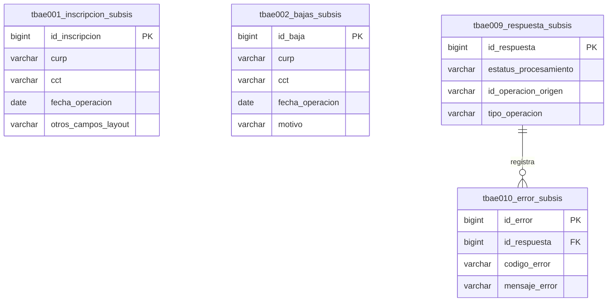

# Diseño Detallado: Diagrama E-R del Área de Staging (TBAE)

## 1. Propósito

Este documento detalla el diagrama Entidad-Relación (E-R) para el **área de staging** de la base de datos `sep_muses`. Esta área, compuesta por las tablas con el prefijo `tbae*`, sirve como el punto de entrada para los datos crudos recibidos de los subsistemas externos antes de su validación y consolidación.

## 2. Diagrama E-R del Área de Staging

El siguiente diagrama muestra la estructura del área de staging. Las tablas aquí almacenan temporalmente la información de inscripciones y bajas antes de ser procesada y transferida a las tablas núcleo (`tbmu*`) dentro del mismo esquema `sep_muses`.

*Las relaciones en este diagrama (arcos polimórficos) se explican en detalle en el documento principal del diccionario de datos de `sep_muses`.*

## 3. Descripción de Entidades

*   **`tbae001_inscripcion_subsis`**: Almacena los registros de inscripciones tal como se reciben en los archivos CSV.
*   **`tbae002_bajas_subsis`**: Almacena los registros de bajas tal como se reciben en los archivos CSV.
*   **`tbae009_respuesta_subsis`**: Tabla polimórfica que registra el estado de procesamiento de una operación, ya sea una inscripción o una baja. El campo `id_operacion_origen` se vincula con la tabla correspondiente.
*   **`tbae010_error_subsis`**: Registra cualquier error de validación encontrado durante el procesamiento de un registro en la tabla de respuestas.
