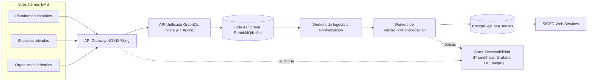

# Entregable 1. Análisis del Flujo del Proceso MUSEMS

## 1. Propósito y Alcance
Este documento resume el análisis detallado del flujo operativo de **MUSEMS (Matrícula Única de Educación Media Superior)** correspondiente al ciclo de trabajo de diciembre de 2025. Se cubren todas las etapas desde la captura inicial de expedientes hasta la notificación de resultados al SIGED. El enfoque prioriza la trazabilidad de datos, la interacción entre áreas y la identificación de puntos de control críticos que aseguran la confiabilidad del padrón.

## 2. Metodología Aplicada
- **Revisión documental y técnica:** Se contrastó la arquitectura lógica vigente —compuesta por el API Gateway (NGINX/Kong), la API unificada GraphQL (Node.js + Apollo), los workers de procesamiento y consolidación, la cola RabbitMQ/Kafka y la base PostgreSQL `sep_muses` con tablas `TBAE*`, `CTMU*` y `TBMU*`— contra el flujo operativo observado. El diagrama mermaid del documento de arquitectura se incorporó al inventario para rastrear dependencias tecnológicas por fase.
- **Talleres colaborativos:** Se realizaron tres sesiones con desarrolladores, QA y responsables de negocio para validar actividades, sistemas involucrados y responsables.
- **Shadowing operativo:** Se observaron dos corridas reales durante la ventana de inscripción para registrar variaciones, tiempos de respuesta y eventos relevantes en colas y workers.
- **Mapeo SIPOC:** Se construyó un SIPOC extendido donde se plasmaron proveedores (subsistemas EMS), entradas (CSV/API GraphQL), procesos (ingesta, validación, consolidación), salidas (notificaciones SIGED) y clientes (control escolar, operación SIGED).

## 3. Descripción del Flujo Macrofase por Macrofase
1. **Captura y Preparación**
   - Origen: Instituciones públicas y privadas mediante plantillas CSV y carga vía API GraphQL expuesta tras un Gateway con validación `X-API-Key`. El gateway enruta a la API unificada, la cual valida estructura y publica el evento en la cola asíncrona.
   - Validaciones inmediatas: estructura del archivo, obligatoriedad de la CURP y consistencia de catálogos básicos (sexo, estado civil, tipo de periodo) usando los catálogos `ctmu001`, `ctmu003`, `ctmu006` descritos en el diccionario de datos.
   - Salida: lote empaquetado con metadatos (hash, número de filas, identificador de subsistema) y acuse automático para el subsistema.
2. **Ingesta y Normalización**
   - Ingesta vía colas asíncronas; transformación inicial en la tabla de staging `muses_dev.tbae001_inscripcion`.
   - Normalización de texto, fechas y catálogos; registro de estatus en `ctmu011_estatus_procesamiento`. El worker de procesamiento inicial ejecuta reglas anti inyección (consultas parametrizadas) y deja bitácora estructurada en formato JSON para observabilidad.
3. **Validación de Reglas de Negocio**
   - Reglas automáticas ejecutadas mediante scripts SQL (ver Entregable 4) antes de promover datos a tablas maestras (`tbmu006_inscripcion`).
   - Identificación de duplicidades por CURP/matrícula, verificación de certificados y correspondencia CCT-programa.
4. **Consolidación y Retroalimentación**
   - Cruce con catálogos maestros y con `tbae002_bajas` para detectar inconsistencias.
   - Generación de evidencias y envío de estatus a instituciones vía API.
5. **Cierre y Notificación**
   - Emisión de reportes de control escolar, actualización de indicadores y notificación a SIGED mediante el worker dedicado que expone servicios certificados TLS y adjunta el `Trace ID` de cada operación.
   - Archiving controlado de bitácoras y datos sensibles con la estrategia de seguridad definida: cifrado TLS extremo a extremo, tokens OIDC para usuarios `muses-web`, API Keys para sistemas estatales y almacenamiento de secretos en Vault.

## 4. Actores y Responsabilidades
| Actor | Rol dentro del flujo | Responsabilidades clave |
|------|----------------------|--------------------------|
| Equipo de Desarrollo | Custodios del backend y pipelines | Mantenimiento de colas, jobs y scripts de validación. |
| QA Funcional | Supervisión de calidad | Definición y ejecución de planes de prueba, análisis de hallazgos. |
| Control Escolar | Dueños del proceso | Validar reglas de negocio, aprobar excepciones y emitir dictámenes. |
| DBA | Operación base de datos | Garantizar integridad de datos, monitorear desempeño y respaldos. |
| Operación SIGED | Integración externa | Recibir padrones consolidados y confirmar carga exitosa. |

## 5. Puntos de Control Críticos
| ID | Descripción | Momento del flujo | Responsable | Evidencia |
|----|-------------|-------------------|-------------|-----------|
| PC-01 | Validación estructural de lotes | Captura | QA técnico | Log de ingestión (JSON con `http_requests_total`, hash SHA-256, API Key usada) almacenado en el stack ELK. |
| PC-02 | Normalización de catálogos | Ingesta | DBA | Job `normalize_catalogs` que cruza `tbae001_inscripcion` contra catálogos `ctmu001`, `ctmu003`, `ctmu004` y deja registro en `tbae010_error`. |
| PC-03 | Reglas con severidad Alta | Validación | Desarrollo | Reportes de ejecución de scripts VAL-01 a VAL-05 con métricas `events_processed_total` y CSV firmados. |
| PC-04 | Cierre de ventana de incidencias | Consolidación | Control Escolar | Minuta formal con acuerdos AC-2301–AC-2303, asistentes y compromisos firmados. |
| PC-05 | Notificación SIGED | Cierre | Operación SIGED | Registro en `tbmu006_inscripcion.notificado_siged = true`, acuse webservice y traza Jaeger asociada. |

## 6. Riesgos Identificados y Acciones
- **Dependencias externas de catálogos**: se documentó procedimiento de verificación diaria y fallback para trabajar con última versión conocida, incluyendo hashes de referencia por catálogo y alarmas Prometheus.
- **Diferencias en CURP/CCT**: se ejecutan reglas de conciliación y se habilitó canal con RENAPO para resolver casos especiales, apoyándose en trazas distribuidas para reproducir casos.
- **Sobrecarga en horarios pico**: se habilitó escala horizontal para colas de ingestión y se monitoriza con dashboards Grafana (métricas `queue_messages_ready`, `event_processing_duration_seconds`) y alertas automáticas.

## 7. Conclusiones
El flujo MUSEMS quedó descrito con la trazabilidad necesaria para continuar su afinación; sin embargo, aún se requieren definiciones y entregables adicionales tanto del área usuaria como del equipo de desarrollo para garantizar el flujo completo. El usuario debe cerrar pendientes relacionados con reglas excepcionales, catálogos diferenciales y criterios de aceptación por subsistema; desarrollo debe formalizar los mecanismos de automatización de pruebas, observabilidad y gobierno de colas para cubrir todos los escenarios. Mientras estas tareas permanezcan abiertas, los puntos de control ayudan a contener riesgos, pero el proceso no puede considerarse totalmente asegurado ni listo para operación continua.

## 8. Diagrama de Componentes

- **Gateway** aplica controles de seguridad (`X-API-Key`, rate limiting) y enruta solo cargas válidas.
- **API GraphQL** concentra reglas de formato, auditoría y publica eventos hacia la cola para desacoplar picos de demanda.
- **Workers** se dividen en ingesta/normalización y validación/consolidación para aislar responsabilidades; consumen de la cola y actualizan bitácoras transaccionales.
- **Base PostgreSQL** almacena staging y tablas maestras, exponiendo vistas específicas para notificación SIGED y para los dashboards operativos.
- **Observabilidad** recibe métricas, logs y trazas desde gateway y workers, habilitando alertas ante fallas en cualquiera de los componentes.
