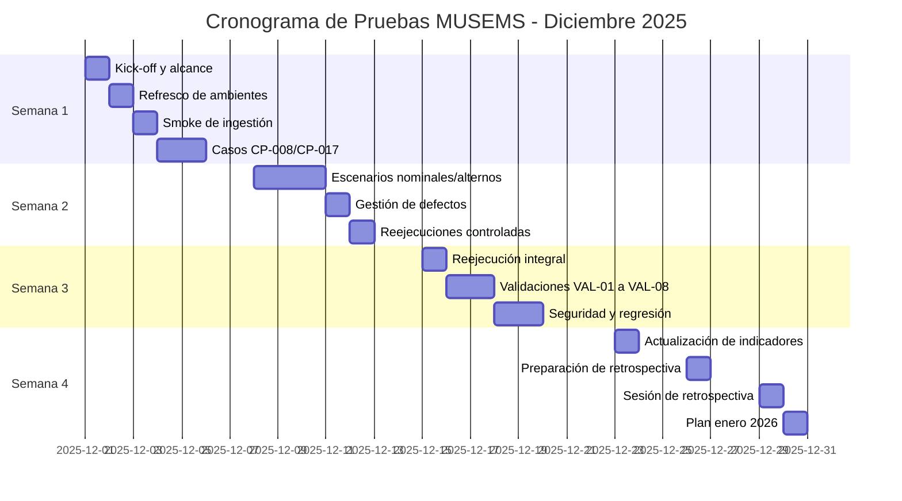
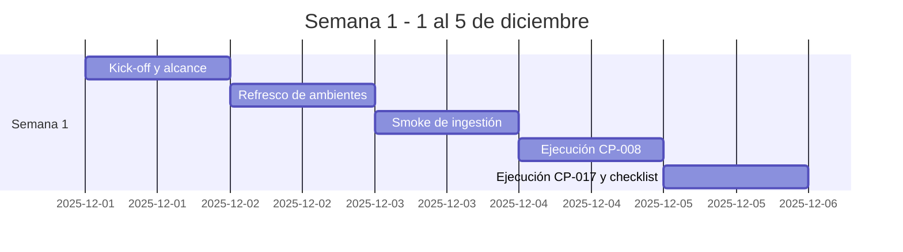
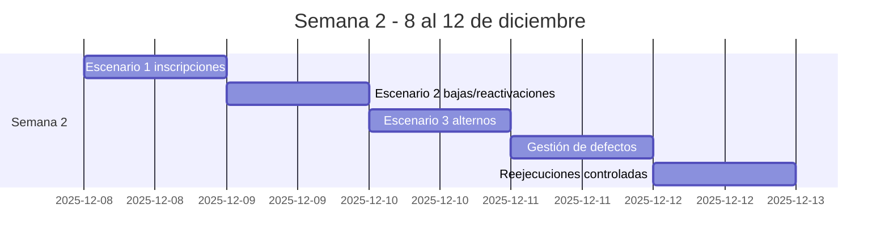
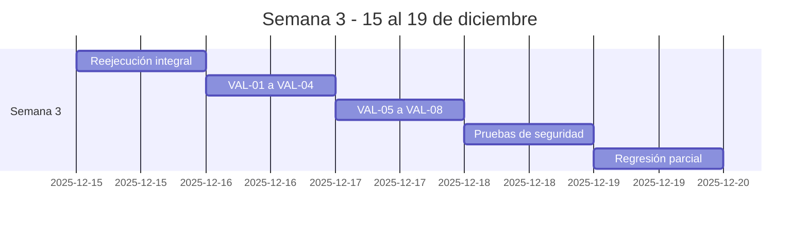
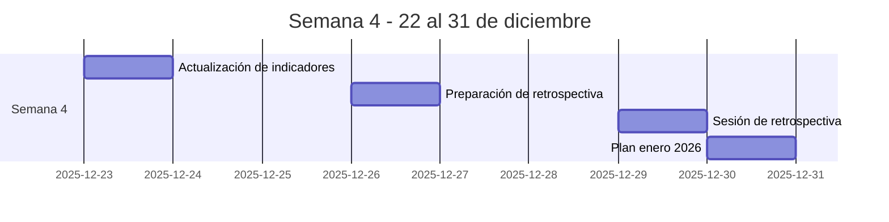

# Entregable 2. Planes de Trabajo para Pruebas de Funcionamiento MUSEMS

## 1. Objetivo
Definir el plan integral de pruebas funcionales y técnicas del proceso MUSEMS para el ciclo de diciembre 2025. Se detallan estrategias, cronogramas, recursos, escenarios, bitácoras y métricas de salida que aseguran la trazabilidad del aseguramiento de calidad.

## 2. Alcance Detallado
- **Cobertura funcional end-to-end:** Inscripciones, bajas, evaluaciones, certificaciones, titulación y catálogos, replicando los escenarios sintetizados en la guía oficial (CURP válidas, CCT inactivos, duplicidades, firmas digitales, etc.).
- **Capa técnica completa:** API Gateway (validaciones de layout y API Key), servicios de colas, workers de procesamiento/ETL, base PostgreSQL (`tbae*`, `tbmu*`, `ctmu*`) y capa `muses-web` para consulta.
- **Tipologías de prueba:** unitarias, integración, sistema/API, aceptación, rendimiento, carga, estrés, seguridad y auditoría.
- **Fuera de alcance:** infraestructura de redes externas y sistemas estatales; únicamente se simulan a través de datos sintéticos controlados.

## 3. Estrategia de Pruebas
| Dimensión | Descripción ampliada |
|-----------|---------------------|
| Tipos | - **Unitarias:** Jest/Karma para controladores API y componentes Angular. - **Integración:** validación de flujos API→Cola→Worker→BD usando Postman + workers instrumentados. - **Sistema (API E2E):** ejecución de lotes CSV completas y consultas GraphQL reales. - **Aceptación:** usuarios de control escolar navegando `muses-web` con rol OIDC asignado. - **No funcionales:** carga, estrés, seguridad, disponibilidad y trazabilidad (UUID por evento). |
| Técnicas | Datasets sintéticos versionados + datos anonimizados; mocks de RENAPO/CCT; automatización CI/CD para despliegues transitorios; instrumentación con Prometheus/Grafana/Jaeger. |
| Criterios de Entrada | Código desplegado en QA, unitarias ≥ 95 % críticas, catálogos actualizados, ambientes estables, credenciales OIDC vigentes. |
| Criterios de Salida | 0 defectos críticos abiertos, cobertura ≥ 95 % de escenarios críticos, métricas de rendimiento < 3 s promedio, bitácoras completas y acta de conformidad firmada. |

## 4. Calendario Operativo (Diciembre 2025)
Las actividades se desglosan por semana y día con los campos solicitados para asegurar trazabilidad diaria.

### Semana 1 (1-5 dic)
| Tipo prueba | Actividad | Descripción | Fecha inicio | Fecha de fin |
|-------------|-----------|-------------|--------------|--------------|
| Planificación | Kick-off y repaso de alcance | Taller con QA, desarrollo y control escolar para alinear objetivos y dependencias. | 2025-12-01 | 2025-12-01 |
| Preparación | Refresco de ambientes y credenciales | Reinicio de pods, actualización de catálogos y validación de accesos OIDC. | 2025-12-02 | 2025-12-02 |
| Smoke | Smoke de ingestión | Carga de lote `L-2025-12-02` para verificar cola, workers y BD. | 2025-12-03 | 2025-12-03 |
| Funcional | Ejecución CP-008 | Caso de inscripciones nominales con CURP válidas; registro en bitácora. | 2025-12-04 | 2025-12-04 |
| Funcional | Ejecución CP-017 y checklist | Caso de duplicidad matrícula+CURP y checklist de ambientes; reporte diario. | 2025-12-05 | 2025-12-05 |

### Semana 2 (8-12 dic)
| Tipo prueba | Actividad | Descripción | Fecha inicio | Fecha de fin |
|-------------|-----------|-------------|--------------|--------------|
| Funcional | Escenario 1: Inscripciones nominales | Lotes CP-008/CP-009 completos con monitoreo de defectos BUG-101. | 2025-12-08 | 2025-12-08 |
| Funcional | Escenario 2: Bajas y reactivaciones | Ejecución CP-010 y CP-011 con seguimiento de `tbae002_bajas`. | 2025-12-09 | 2025-12-09 |
| Funcional | Escenario 3: Alternos (CCT inactivo, CURP duplicada) | Casos CP-015/CP-016 con captura de evidencias en CSV y dashboard. | 2025-12-10 | 2025-12-10 |
| Gestión defectos | Board Kanban y BUG-101..103 | Reunión diaria para triage, asignación y actualización de métricas. | 2025-12-11 | 2025-12-11 |
| Funcional | Reejecuciones controladas | Validación de fixes en ambiente QA antes de pasar a semana 3. | 2025-12-12 | 2025-12-12 |

### Semana 3 (15-19 dic)
| Tipo prueba | Actividad | Descripción | Fecha inicio | Fecha de fin |
|-------------|-----------|-------------|--------------|--------------|
| Funcional | Reejecución integral | Lotes completos tras correcciones para medir reincidencia de defectos. | 2025-12-15 | 2025-12-15 |
| Validaciones | VAL-01 a VAL-04 | Ejecución de scripts de integridad CURP, unicidad y programas académicos. | 2025-12-16 | 2025-12-16 |
| Validaciones | VAL-05 a VAL-08 | Turnos, bajas y notificación SIGED con captura de logs firmados. | 2025-12-17 | 2025-12-17 |
| Seguridad | Pruebas básicas de seguridad | Escaneo de endpoints, revisión de roles y pruebas de autorización negativa. | 2025-12-18 | 2025-12-18 |
| Regresión | Regresión parcial prioritaria | Suite automatizada sobre casos críticos antes de congelar cambios. | 2025-12-19 | 2025-12-19 |

### Semana 4 (22-31 dic)
| Tipo prueba | Actividad | Descripción | Fecha inicio | Fecha de fin |
|-------------|-----------|-------------|--------------|--------------|
| Seguimiento | Actualización de indicadores | KPI vs metas (cobertura, tiempo por lote, defectos críticos). | 2025-12-23 | 2025-12-23 |
| Planificación | Preparación de retrospectiva | Recopilación de hallazgos para discusión con áreas usuarias. | 2025-12-26 | 2025-12-26 |
| Cierre | Sesión de retrospectiva | Revisión de AC-2401..2403 y responsables. | 2025-12-29 | 2025-12-29 |
| Planificación | Plan enero 2026 | Definición de backlog y ventanas para nuevas pruebas/regresiones. | 2025-12-30 | 2025-12-30 |

### Diagrama de Gantt

#### Diagrama de Gantt - Semana 1

#### Diagrama de Gantt - Semana 2

#### Diagrama de Gantt - Semana 3

#### Diagrama de Gantt - Semana 4

## 5. Plan por Fase y Módulo
### Preparación
- Actualizar catálogos, layouts y scripts CI/CD; parametrizar pipelines para publicar mensajes en cola y clonar entornos.
- Construir datasets por módulo reutilizando la tabla de escenarios (CURP válidas, CCT inactivos, motivos de baja, evaluaciones duplicadas, etc.).
- Generar hash SHA-256 y registrar procedencia por lote.

### Ejecución
- Etiquetar cada lote (ej. `L-2025-12-01`) y mapearlo contra `tbae001_inscripcion` para trazabilidad.
- Secuenciar casos diarios por módulo: recepciones API, processing worker, consulta, catálogos.
- Registrar resultados y métricas (duración, incidencias) inmediatamente en la bitácora central.

### Cierre
- Consolidar KPI vs metas; revisar que cada requerimiento RF-001..RF-014 tenga al menos un caso ejecutado exitoso.
- Celebrar retrospectiva: qué funcionó, qué mejorar, acuerdos AC-2401..AC-2403 con responsables y fechas.

### Detalle por Módulo (extracto del plan por componente)
| Módulo | Pruebas clave | Criterio |
|--------|---------------|----------|
| Recepción (API) | Validar layout CSV, publicar en cola, cargar 500 req/s por 5 min. | Respuesta < 500 ms, error < 0.1 %. |
| Procesamiento (Workers) | Validar CURP con mock RENAPO, transformar datos, registrar errores en `tbae010_error`. | Registro conforme a resultado, cobertura ≥ 85 %. |
| Consulta / Front | Formularios de búsqueda, guardas de rol, E2E login→consulta. | Usuario completa tarea < 2 min. |

## 6. Roles y RACI
| Actividad | Responsable | Apoyo | Consultado | Informado |
|-----------|-------------|-------|------------|-----------|
| Preparar datasets y ambientes | QA Funcional | DBA, DevOps | Control Escolar | PMO |
| Ejecutar casos funcionales | QA Funcional | Desarrollo | Control Escolar | PMO |
| Automatizar/regresión | Desarrollo | QA | Control Escolar | PMO |
| Revisar hallazgos y aprobar salida | Control Escolar | QA, Desarrollo | PMO | Dirección |

## 7. Bitácora y Evidencias
- **Formato único:**

| Campo | Descripción |
|-------|-------------|
| `id_caso` | Clave CP/RF (ej. CP-008). |
| `lote` | Identificador operativo (L-2025-12-02). |
| `validacion/script` | VAL-XX o script asociado. |
| `resultado` | OK / WARN / FAIL. |
| `incidencias` | Lista de IDs registrados (INC-001, BUG-101). |
| `evidencia` | Ruta al CSV/log firmado, hash y enlace a dashboard. |
| `responsable` | Ejecutor y revisor. |

- **Automatización:** se emplean utilidades internas (scripts `generate_comments` y plantillas Markdown) para consolidar comentarios y logs estructurados.
- **Almacenamiento:** carpeta `docs/entregables_dic_2025/evidencias/` con estructura `/<lote>/<validacion>.csv` y firmas digitales.

## 8. Indicadores de Éxito
- Cobertura ≥ 95 % de escenarios críticos y 100 % de RF-001..RF-014.
- Tiempo promedio de ejecución por lote ≤ 4 minutos; total campaña ≤ 16 h.
- Reincidencia de defectos ≤ 5 %; cierre de críticos ≤ 24 h.
- Métricas de rendimiento del Gateway: latencia p95 < 3 s; disponibilidad ≥ 99.8 % durante pruebas.

## 9. Riesgos y Mitigaciones
| Riesgo | Impacto | Mitigación |
|--------|---------|------------|
| Ambientes inestables | Alto | Ventanas nocturnas, snapshots previos y playbook de restauración. |
| Datos faltantes de instituciones | Medio | Uso de datasets sintéticos por módulo + simuladores de cola. |
| Cambios de alcance tardíos | Medio | Congelar backlog al cierre de semana 2; cualquier cambio requiere acta con impacto en cronograma y capacidad. |
| Dependencia de servicios externos (RENAPO/SIGED) | Medio | Mocks versionados y registro de latencias para comparar contra ambiente real. |

## 10. Conclusión
El plan operacionaliza la estrategia de pruebas de MUSEMS y deja una guía ejecutable para QA, desarrollo y control escolar. Conecta requerimientos, escenarios, cronograma, bitácoras y métricas para asegurar que cada hallazgo cuente con evidencia rastreable y que el proceso pueda auditarse o repetirse sin pérdida de información.
