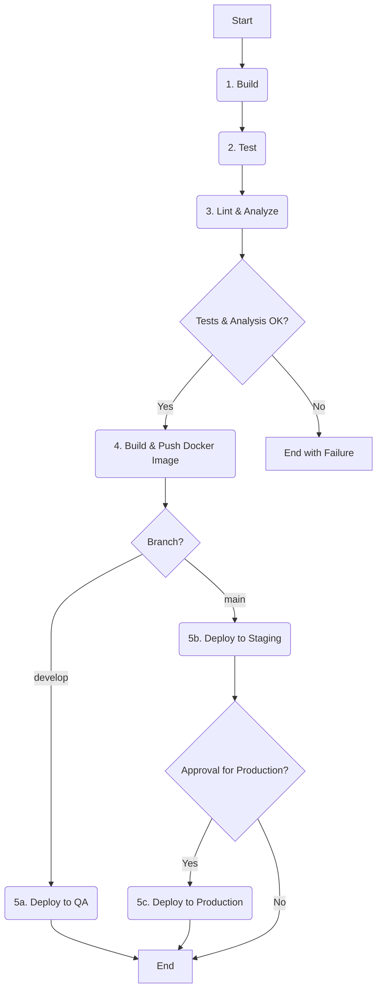

# Estrategia de Integración y Despliegue Continuo (CI/CD)

## 1. Introducción

Este documento define la estrategia de **Integración Continua (CI)** y **Despliegue Continuo (CD)** para el proyecto SEP-MUSES. El objetivo de CI/CD es automatizar el proceso de construcción, prueba y despliegue del software, lo que nos permite entregar valor de manera más rápida, segura y confiable.

*   **Integración Continua (CI):** Es la práctica de integrar automáticamente los cambios de código de múltiples desarrolladores en un repositorio central. Cada integración se verifica mediante una construcción y una serie de pruebas automatizadas, lo que permite detectar errores de manera temprana.
*   **Despliegue Continuo (CD):** Es la práctica de desplegar automáticamente en producción todos los cambios de código que pasan la etapa de CI. Para SEP-MUSES, adoptaremos una variante llamada **Entrega Continua**, donde el despliegue a producción requerirá una aprobación manual, brindando un control adicional.

## 2. Estrategia de Ramificación: GitFlow

Para gestionar el ciclo de vida del desarrollo de manera ordenada, se adoptará el modelo de ramificación **GitFlow**. Este modelo utiliza un conjunto de ramas con roles específicos:

*   `main`: Esta rama siempre contendrá el código estable y listo para producción. Nadie hace commit directamente a `main`.
*   `develop`: Es la rama principal de desarrollo. Contiene el código con las últimas funcionalidades integradas. Sirve como base para los nuevos desarrollos.
*   `feature/*` (ej. `feature/login-usuario`): Cada nueva funcionalidad se desarrolla en su propia rama, que se crea a partir de `develop`. Una vez completada, se fusiona de nuevo a `develop` a través de un Pull Request.
*   `release/*` (ej. `release/v1.1.0`): Cuando `develop` alcanza un estado estable y está listo para un nuevo lanzamiento, se crea una rama de `release`. En esta rama solo se realizan correcciones menores y se prepara la documentación. Una vez lista, se fusiona tanto a `main` (para el despliegue) como a `develop` (para incorporar las correcciones).
*   `hotfix/*` (ej. `hotfix/error-curp-validacion`): Si se detecta un error crítico en producción (`main`), se crea una rama de `hotfix` a partir de `main`. La corrección se realiza aquí y, una vez validada, se fusiona a `main` y `develop`.

## 3. Pipeline de CI/CD con GitHub Actions

Se utilizará **GitHub Actions** para implementar nuestro pipeline de CI/CD, ya que el código reside en GitHub. Se definirán flujos de trabajo (workflows) en archivos YAML dentro del directorio `.github/workflows/`.

El pipeline principal se activará en cada **Pull Request hacia `develop`** y en cada **commit a `main` y `develop`**.

### 3.1. Fases del Pipeline

El siguiente diagrama ilustra las fases (jobs) que compondrán el pipeline:

### 3.2. Descripción de las Fases

1.  **Build (Construcción):**
    *   **Acción:** Se compila el código fuente (si aplica, como en el caso del frontend de Angular) y se instalan todas las dependencias.
    *   **Propósito:** Asegurar que el código es compilable y que todas las dependencias están correctamente definidas.

2.  **Test (Pruebas):**
    *   **Acción:** Se ejecutan las pruebas automatizadas, principalmente las **pruebas unitarias** y de **integración**.
    *   **Propósito:** Verificar que los nuevos cambios no han introducido regresiones y que la lógica de negocio funciona como se espera.

3.  **Lint & Analyze (Análisis Estático):**
    *   **Acción:** Se ejecutan herramientas de análisis estático de código como un "linter" (para asegurar el estilo de código) y **SonarQube** (o una herramienta similar).
    *   **Propósito:** Detectar "code smells", posibles bugs y vulnerabilidades de seguridad antes de que el código sea fusionado.

4.  **Build & Push Docker Image (Construir y Subir Imagen Docker):**
    *   **Acción:** Si todas las fases anteriores son exitosas, el pipeline construirá una imagen de Docker para cada microservicio. La imagen será etiquetada con un identificador de la versión (ej. el hash del commit o un tag semántico).
    *   **Propósito:** Crear el artefacto inmutable que será desplegado en todos los entornos. La imagen se subirá a un registro de contenedores (ej. GitHub Container Registry, Docker Hub).

5.  **Deploy (Despliegue):**
    *   **Acción:** El pipeline desplegará la imagen de Docker en el entorno correspondiente.
    *   **Propósito:** Poner en funcionamiento la nueva versión del servicio.
    *   **Flujo:**
        *   Si el cambio es en la rama `develop`, se despliega automáticamente al entorno de **QA**.
        *   Si el cambio es en la rama `main` (proveniente de un `release` o `hotfix`), se despliega automáticamente al entorno de **Staging**.
        *   El despliegue a **Producción** desde `main` requerirá una **aprobación manual** desde la interfaz de GitHub Actions para mayor seguridad.
