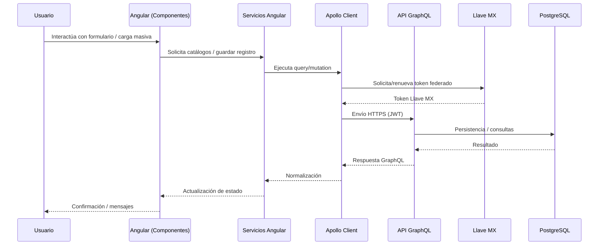

# DIAGRAMA DE ARQUITECTURA Y COMPONENTES DE LOS SISTEMAS WEB EN DESARROLLO

**Unidad de Administración y Finanzas**  
**Dirección General de Tecnologías de la Información y Comunicaciones**

---

## 1. Propósito y alcance (octubre 2025)

Documentar la estructura lógica y tecnológica de los sistemas web construidos durante octubre para el proyecto **MUSES Web (Angular)**, detallando:

- Los componentes *standalone* implementados.
- Los servicios front-end que abstraen catálogos, formularios y cargas masivas.
- El flujo actual basado en datos simulados y persistencia en `localStorage`.
- La arquitectura objetivo con **GraphQL** y **PostgreSQL**, cuya implementación inicia en la siguiente etapa.

---

## 2. Resumen ejecutivo de avances

- Se consolidó el enrutamiento principal (`inicio`, `inscripcion`, `baja`, `carga-masiva`, `carga-masiva/detalle`, `configuracion-instituciones`) usando componentes *standalone* registrados en `app.routes.ts`.  
- El formulario de inscripción administra más de 90 campos con validaciones tipificadas, configuración dinámica por institución y sincronización con catálogos simulados.  
- Se habilitó la administración de configuración institucional (visibilidad/obligatoriedad de campos) con servicios que emulan llamadas remotas mediante latencia simulada.  
- La carga masiva procesa archivos CSV en lotes, valida encabezados, normaliza registros y conserva el progreso en almacenamiento local.
- Se acordó la arquitectura de integración futura: **Angular ↔ Apollo Client ↔ API GraphQL ↔ PostgreSQL**, incorporando autenticación federada con **Llave MX** en la siguiente etapa y conservando la compatibilidad con el trabajo realizado.

---

## 3. Arquitectura lógica actual (estado octubre 2025)

```mermaid
flowchart TD
    U[Usuario final] --> SPA[SPA Angular MUSES Web]
    subgraph SPA
        C[Componentes standalone\n(Inicio, Inscripción, Baja, Carga Masiva, Configuración)]
        S[Servicios front-end\n(Catálogos, Formularios, Carga Masiva)]
        L[(localStorage\nPersistencia temporal)]
        D[Datos simulados\n(catálogos en memoria)]
    end
    C --> S
    S --> D
    S --> L
    C --> L
    SPA -. Preparado .-> AP[Apollo Client\n(Integración futura)]
    SPA -. Autenticación futura .-> LL[Llave MX\n(Single Sign-On)]
```

**Características claves del estado actual**

- Los catálogos y configuraciones se obtienen de servicios que retornan observables con latencia simulada.
- Los formularios guardan registros individuales o masivos en `localStorage` para pruebas funcionales sin backend.
- Se mantiene una capa de servicios desacoplada, lista para conectarse a GraphQL sin reescritura de componentes.

---

## 4. Arquitectura tecnológica objetivo con GraphQL (siguiente etapa)

```mermaid
flowchart LR
    subgraph Frontend Angular
        SPA[Angular 18\nComponentes standalone]
        Apollo[Apollo Client\nAngular]
    end
    subgraph Backend GraphQL (pendiente de desarrollo)
        Gateway[Servidor Node/Express]
        Schema[Schema GraphQL\n(Queries/Mutations)]
        Resolvers[Resolvers y validaciones]
    end
    subgraph Datos Corporativos
        DB[(PostgreSQL\nsep_muses)]
        ETL[Procesos ETL / sincronización]
    end
    subgraph Servicios de identidad (pendiente)
        Llave[Llave MX\n(Proveedor de identidad)]
    end

    SPA --> Apollo
    Apollo --> Gateway
    Gateway --> Schema
    Schema --> Resolvers
    Resolvers --> DB
    Resolvers --> ETL
    Gateway --> Llave
    Llave --> Gateway

    note right of Gateway: Implementación programada
    note right of Schema: Definición basada en catálogos actuales
    note right of Llave: Integración prevista para autenticación
```

**Lineamientos acordados para la implementación próxima**

1. Reutilizar los servicios actuales como clientes de `Apollo` mediante `HttpLink` y `InMemoryCache` (sin cambios en componentes).  
2. Publicar queries/mutations equivalentes a los catálogos actuales (`catálogos`, `configuración de formularios`, `carga masiva`).  
3. Gestionar autenticación y auditoría en el servidor GraphQL; los componentes mantendrán los *hooks* para tokens desde `localStorage`.  
4. Persistir definitivamente en PostgreSQL usando los esquemas `sep_ides` → `sep_muses` documentados en la base de datos corporativa.

---

## 5. Módulos y componentes de Angular

| Componente (ruta) | Responsabilidad principal | Interacciones relevantes |
| --- | --- | --- |
| `InicioComponent` (`/inicio`) | Presenta resúmenes y accesos a los flujos operativos. | Renderizado inicial de la SPA y navegación declarada en `app.routes.ts`. |
| `InscripcionComponent` (`/inscripcion`) | Gestiona el formulario individual de inscripción/baja, aplica configuraciones por institución y valida CURP, CCT, RVOE, fechas y catálogos. | Consulta catálogos simulados, carga configuraciones con `ConfiguracionFormulariosService`, guarda registros en `localStorage` para continuidad del usuario. |
| `BajaComponent` (`/baja`) | Reutiliza la lógica de inscripción en modo baja para cancelar registros. | Comparte servicios y almacenamiento con `InscripcionComponent`.
| `CargaMasivaComponent` (`/carga-masiva`) | Importa archivos CSV, valida encabezados, procesa lotes y conserva registros en memoria/`localStorage`. | Orquesta `CargaMasivaService`, muestra progreso y permite descargar resultados. |
| `CargaMasivaDetalleComponent` (`/carga-masiva/detalle`) | Visualiza y gestiona el registro seleccionado de la carga masiva. | Consulta `CargaMasivaService` para leer/establecer el registro activo. |
| `ConfiguracionInstitucionesComponent` (`/configuracion-instituciones`) | Administra visibilidad y obligatoriedad de campos por institución, incluyendo etiquetas personalizadas. | Consume `GestionConfiguracionFormulariosService` y persiste cambios en la *store* simulada.

---

## 6. Servicios y capa de datos en el frontend

| Servicio | Descripción técnica | Estado actual |
| --- | --- | --- |
| `CatalogosService` | Expone catálogos de países, entidades, niveles educativos, motivos de baja y otros mediante observables que simulan latencia (`delay`). | Retorna datos *hardcodeados*; se migrará a queries GraphQL (`catalogs`, `lookupTables`) autenticadas vía Llave MX. |
| `ConfiguracionFormulariosService` | Recupera configuraciones por institución desde una *store* en memoria, devolviendo copias para evitar efectos colaterales. | Preparado para sustituir la *store* por consultas GraphQL (`institutionFormConfig`). |
| `ConfiguracionFormulariosStore` | Administra configuraciones base con `BehaviorSubject`, permitiendo actualizaciones en caliente y lectura inmediata. | Servirá como adaptador temporal hasta que la API GraphQL entregue configuraciones persistentes. |
| `GestionConfiguracionFormulariosService` | Emula operaciones CRUD (listar, obtener, guardar) sobre configuraciones institucionales con latencia controlada. | Mapeará a mutations GraphQL (`updateInstitutionConfig`). |
| `CargaMasivaService` | Valida CSV (encabezados, tamaño máximo, procesamiento por lotes de 200 registros) y notifica avance mediante un `Observable<EventoCargaMasiva>`. | Será reemplazado por una mutation GraphQL que delegue al backend la validación y persistencia, manteniendo la notificación en tiempo real por WebSocket/GraphQL subscriptions. |

---

## 7. Gestión de datos y persistencia temporal

- Los formularios de inscripción y baja almacenan registros en `localStorage`, permitiendo reanudar sesiones y auditar pruebas sin backend.  
- La carga masiva persiste lotes importados y metadatos de archivos en `localStorage`, manteniendo trazabilidad de sesiones de prueba.  
- La configuración institucional se mantiene en memoria con copia defensiva para emular un backend y verificar reglas de negocio.

**Impacto para la siguiente etapa**

1. Sustituir las operaciones de lectura/escritura local por `mutations`/`queries` GraphQL sin alterar la firma de los servicios.
2. Incorporar `ApolloAngularModule` en `app.config.ts` para crear enlaces HTTP (y a futuro WebSocket).
3. Gestionar el ciclo de autenticación con tokens JWT provenientes del backend y almacenarlos en `localStorage` como se hace actualmente con los datos simulados.
4. Integrar el inicio de sesión y la verificación de identidad con **Llave MX** para emitir tokens federados consumidos por Apollo Client.

---

## 8. Diagrama de interacción de componentes con GraphQL (planeado)



---

## 9. Consideraciones de seguridad y calidad

- Mantener validaciones estrictas en cliente (regex de CURP, CCT, RVOE, fechas, límites de lotes) para reducir rechazos tempranos.  
- Incorporar auditoría y control de sesiones cuando la API GraphQL esté disponible; la estructura de servicios ya contempla intercambio de tokens.
- Coordinar la federación de identidad con **Llave MX**, asegurando flujos OAuth 2.0/OIDC compatibles con los tokens consumidos por Apollo Client.
- Planificar métricas y *logging* en el backend GraphQL para registrar procesos de carga masiva y configuración institucional.

---

## 10. Firmas

**Elaboró:**  
José Guadalupe Gutiérrez Arévalo  
<joseg.gutierrez@nube.sep.gob.mx>

**Revisó:**  
David León Gómez  
<david.leon@nube.sep.gob.mx>

---

**Página 1 de 1**
