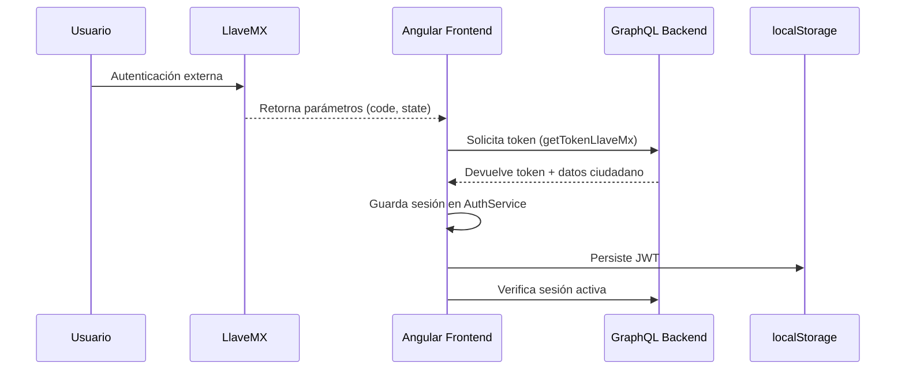
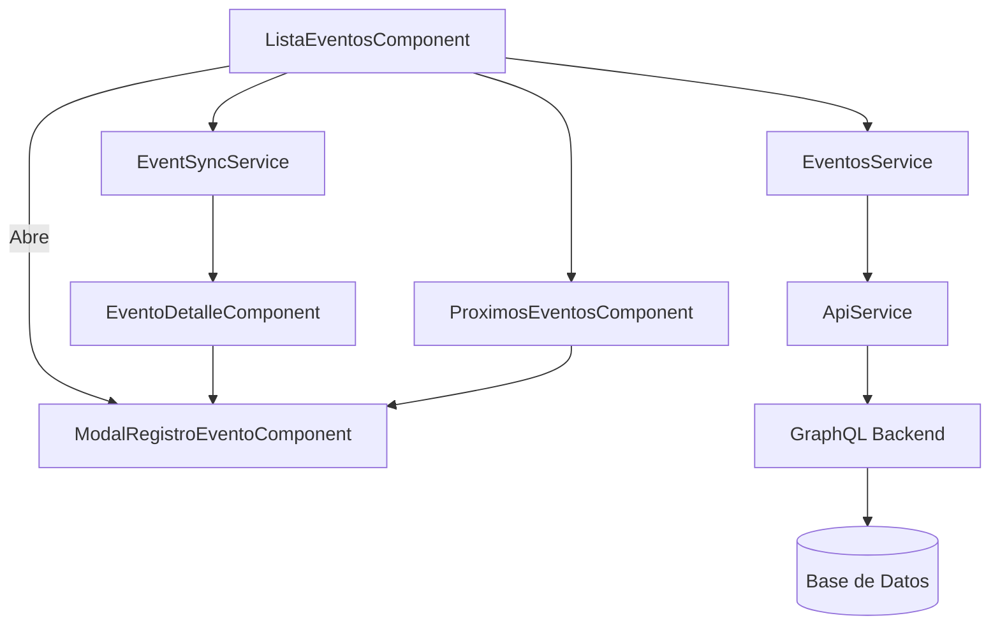
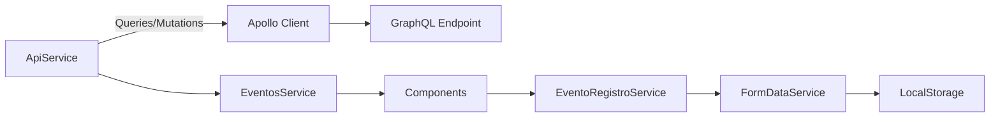
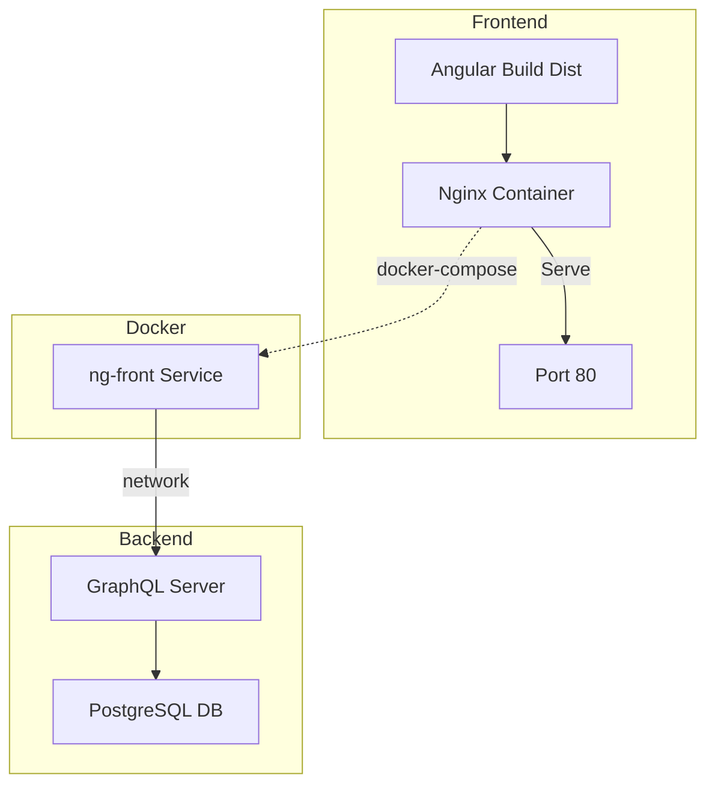

# BITÁCORA DE DESARROLLO CON DETALLE DE TAREAS POR SPRINT O MÓDULO ENTREGADO

**Unidad de Administración y Finanzas**  
**Dirección General de Tecnologías de la Información y Comunicaciones**

---

## 1. Propósito

Bitácora de desarrollo con el detalle de tareas realizadas por sprint o módulo entregado, con evidencia de commits y versiones en GitHub, incluyendo referencias a solución de problemáticas reportadas y cambios implementados mediante *pull requests*.

---

## 2. Bitácora de Desarrollo – Octubre 2025

### Resumen del Sprint

- **Periodo:** 1 – 31 octubre 2025.
- **Objetivo principal:** Consolidar los flujos de inscripción individual, bajas y carga masiva incorporando navegación dedicada, persistencia local y refinamientos de experiencia de usuario antes de integrar GraphQL.【F:web/documentos/muses_web_arquitectura.md†L1-L34】【F:web/documentos/inscripcion_diccionario_campos.md†L1-L33】
- **Pull requests fusionados relevantes:**
  - `#30 – codex/separate-enrollment-and-withdrawal-components-nedvj2` – incorpora el flujo completo de carga masiva con servicios, pruebas y rutas dedicadas (merge `bcd81a8`, 15 oct 2025).
  - `#34 – codex/update-processing-bar-functionality-djq4hw` – habilita la vista de detalle para registros importados y navegación entre rutas (merge `2ac8c71`, 15 oct 2025).
  - `#33 – codex/update-processing-bar-functionality-mpymxe` – expone columnas clave y acciones contextuales en la tabla de progreso (merge `f04e2b7`, 15 oct 2025).
  - `#32 – codex/update-processing-bar-functionality-dgzatg` – corrige la liberación de suscripciones y estabilidad del componente de carga (merge `d46692f`, 15 oct 2025).
- **Commits destacados:**
  - `2d8ae7f` (15 oct 2025) – Implementa la carga masiva por CSV, componentes *standalone* y pruebas automatizadas asociadas.
  - `52af154` (15 oct 2025) – Persiste los lotes importados en `localStorage` y crea el componente `carga-masiva-detalle`.
  - `2f2af2c` (15 oct 2025) – Optimiza validaciones, tiempos de procesamiento y visualización del avance de importación.
  - `016ff95` (15 oct 2025) – Corrige *bindings* y filtros para mantener la trazabilidad entre tabla y detalle.

La entrega consolida los flujos operativos descritos en la arquitectura vigente y en el diccionario de campos, asegurando que las validaciones normativas sigan el layout oficial mientras se conserva una capa de servicios desacoplada para la transición a GraphQL.【F:web/documentos/muses_web_arquitectura.md†L35-L88】【F:web/documentos/inscripcion_diccionario_campos.md†L4-L52】

### Evidencia de entregables y cobertura

- **Flujo de carga masiva consolidado:** La interfaz permite importar CSV, mostrar progreso por lotes y navegar al detalle del registro con filtros persistentes. Se fundamenta en los componentes `carga-masiva` y `carga-masiva-detalle`, alineados con la arquitectura descrita para MUSES Web.【F:web/documentos/muses_web_arquitectura.md†L35-L119】 Evidencia: PR `#30` (merge `bcd81a8`) y commits `2d8ae7f`, `52af154`.
- **Persistencia y trazabilidad:** Los lotes importados se almacenan en `localStorage`, habilitando la reanudación de sesiones y el seguimiento de errores por registro, en concordancia con el flujo documentado en el diccionario de campos y los catálogos normativos asociados.【F:web/documentos/inscripcion_diccionario_campos.md†L53-L118】 Evidencia: PR `#34` (merge `2ac8c71`) y commit `52af154`.
- **Refinamientos de experiencia y accesibilidad:** Se actualizaron tablas, filtros y encabezados para mejorar la lectura y el contraste del módulo de carga masiva, contemplando mensajes de validación coherentes con el plan de trabajo vigente.【F:web/documentos/muses_web_plan_trabajo.md†L5-L24】 Evidencia: PR `#33` (merge `f04e2b7`), commit `2f2af2c` y ajustes de estilo asociados (`65e201a`, `5c7ef0a`).
- **Documentación complementaria:** Las decisiones de arquitectura y el desglose de componentes quedaron registrados en `muses_web_arquitectura.md`, `muses_web_diseno_componentes.md` y el `Plan de trabajo`, reforzando la trazabilidad entre entregables de código y documentación.【F:web/documentos/muses_web_arquitectura.md†L1-L173】【F:web/documentos/muses_web_diseno_componentes.md†L1-L86】【F:web/documentos/muses_web_plan_trabajo.md†L1-L31】

### Incidencias y problemáticas atendidas

1. **INC-178 – Progreso de importación sincrónico con filtros.**
   - *Síntoma:* Al cambiar filtros durante la importación, la tabla perdía la selección y no se conservaban los registros procesados.
   - *Solución:* Persistencia de resultados en `localStorage`, restauración automática de filtros y sincronización con la vista de detalle.
   - *Evidencia:* PR `#34` (merge `2ac8c71`) y commit `52af154`.

2. **INC-179 – Suscripciones sin liberar en `CargaMasivaComponent`.**
   - *Síntoma:* Se detectó consumo de memoria en pruebas prolongadas debido a observables sin cancelar.
   - *Solución:* Uso correcto de `takeUntilDestroyed` y limpieza explícita de estados reactivos.
   - *Evidencia:* PR `#32` (merge `d46692f`).

3. **INC-181 – Filtros y paginación inconsistentes tras reprocesar lotes.**
   - *Síntoma:* Los filtros de búsqueda no se actualizaban después de volver a cargar un archivo, generando discrepancias entre la tabla y el detalle.
   - *Solución:* Reescritura de *bindings* y normalización de eventos de búsqueda.
   - *Evidencia:* Commit `016ff95`.

### Plan de continuidad (noviembre 2025)

- Incorporar `ApolloAngularModule` y los *links* HTTP definidos en la arquitectura para comenzar la integración con GraphQL sin alterar los componentes actuales.【F:web/documentos/muses_web_arquitectura.md†L89-L143】
- Priorizar las historias PBI-03 (terminar flujo de carga masiva con backend) y PBI-04 (bajas con acuse) del plan de trabajo para noviembre, manteniendo cobertura en pruebas de regresión.【F:web/documentos/muses_web_plan_trabajo.md†L5-L31】
- Elaborar ADRs sobre la federación con Llave MX y el manejo definitivo de catálogos, siguiendo las recomendaciones del documento de arquitectura y del diccionario de campos.【F:web/documentos/muses_web_arquitectura.md†L144-L173】【F:web/documentos/inscripcion_diccionario_campos.md†L119-L172】

---

## 3. Bitácora de Desarrollo – Julio 2025

### Resumen del Sprint

- **Periodo:** 1 – 31 julio 2025  
- **Objetivo principal:** Arrancar el frontend de la plataforma de eventos y habilitar autenticación con LlaveMX.  
- **Pull request fusionado:** `#12 – JG-IntegracionLlaveMX`  
- **Commit merge:** `f1dbd3580beab5b6484784e6148f436e38692593` (24 jul 2025)  

Durante el sprint se completó la versión inicial del *frontend* y la autenticación federada con LlaveMX.  
El *merge* consolidó **29 archivos** nuevos/modificados con más de **5 000 líneas de código**.

---

## 4. Arquitectura y Servicios

### Configuración GraphQL
- `app.config.ts`: registra `HttpLink` y la caché para consumir el API GraphQL.
- `query.ts`: define operaciones `getTokenLlaveMx`, `getDatosLlaveMx`, `generateAuthUrl`, `registrosPorUsuario`.

### Servicios Principales
- **ApiService:** centraliza llamadas GraphQL y maneja *headers* de autorización.  
- **AuthService:** normaliza usuario de LlaveMX, guarda tokens, expone `isAuthenticated$`.  
- **NavComponent:** procesa `code/state`, invoca `getTokenLlaveMx` y actualiza `EventosService`.  
- **AuthGuard:** protege rutas consultando `AuthService.isAuthenticated$`.

### Componentes
- `LoginComponent`, `RegistroComponent`: validaciones, CAPTCHA y conexión al backend.  
- `ListaEventosComponent`, `EventoDetalleComponent`, `ModalRegistroEventoComponent`: gestión de eventos, detalles y registros.  
- `EnlacesInteresComponent`: estructura de navegación y vistas de contenido.

---

## 5. Diagrama — Flujo de Autenticación LlaveMX

---

## 6. Módulos de Eventos *(commit f1dbd35, PR #12)*

Los componentes del dominio **eventos** se implementaron como *standalone* con *lazy loading* y formularios dinámicos.

### 1. ListaEventosComponent
- Carga y ordena eventos desde `ApiService`.
- Maneja autenticación y sincronización mediante `EventosService` y `EventSyncService`.
- Abre `ModalRegistroEventoComponent` para registro o cancelación.

### 2. EventoDetalleComponent
- Carga evento por URL.
- Consulta archivos y programa vía `ApiService`.
- Reutiliza el modal de registro y detecta eventos finalizados.

### 3. ProximosEventosComponent
- Variante enfocada en eventos futuros.
- Reutiliza lógica de lista y el mismo modal de registro.

### 4. RegistroComponent
- Formulario de alta de usuario con CAPTCHA y `FormDataService`.
- Validaciones dinámicas y envío de datos a `ApiService`.

### 5. ModalRegistroEventoComponent
- Modal reutilizable de inscripción/cancelación.
- Valida duplicados, coordina `ApiService`, `EventosService` y `EventoRegistroService`.

### 6. MisEventosComponent
- Lista eventos del usuario actual (próximos y pasados) vía `EventosService`.

---

## 7. Diagrama — Estructura de Módulos de Eventos

---

## 8. Servicios de Datos Reutilizables *(03–24 jul 2025, commit f1dbd35)*

### 1. ApiService
- Centraliza consultas/mutaciones GraphQL (`login`, `getEventos`, `crearRegistroEvento`, `cancelarRegistroEvento`).
- Adjunta tokens y reCAPTCHA cuando aplica.

### 2. EventosService
- Mantiene lista de eventos y usuario con `BehaviorSubject`.
- `cargarEventos()` obtiene datos y los transforma para subsectores y programas.

### 3. EventoRegistroService
- Formularios reactivos con validaciones dinámicas (estados, subsectores, campos “Otro”).

### 4. GraphqlService
- Encapsula llamadas genéricas (`getEntities`, `getDelegationsMunicipalities`).

### 5. Operaciones GraphQL
- **Queries:** `login`, `getEventos`  
- **Mutations:** `crearRegistro`, `cancelarRegistro`

---

## 9. Diagrama — Flujo de Datos y Servicios

---

## 10. Infraestructura de Despliegue *(03 – 24 jul 2025)*

### Dockerfile
- Imagen base `nginx:alpine`.  
- Copia `default.conf` y artefacto compilado `dist/angular-graphql-frontend/browser`.  
- Expone puerto 80.

### docker-compose.yml
- Define servicio `ng-front` conectado a red `app-net`.  
- Configura **modo Swarm**, 3 réplicas y límites de recursos.

### server.js (Express)
- Alternativa Node.js, sirve carpeta compilada en puerto 8083.  
- Redirige rutas SPA a `index.html`.

### default.conf (Nginx)
- Virtual host SPA con `try_files` para redirigir rutas inexistentes a `index.html`.

---

## 11. Diagrama — Infraestructura de Despliegue

---

## 12. Sección “Manual” y Activos

- Ruta `/manual` carga componente *standalone* `ManualComponent`.  
- Incluye buscador con *debounce*, conteo de resultados y resaltado dinámico.  
- `descargarManual()` genera enlace temporal para descarga PDF (`Manual-de-Uso-de-NotebookLM.pdf`).  
- Carpeta `/assets/documentos/` contiene manuales y cartas responsivas.

---

## 13. Detalle de Actividades Realizadas

| Fecha | Módulo / Archivo Clave | Descripción | Evidencia |
|-------|------------------------|--------------|------------|
| **01–14 oct** | Enrutamiento standalone | Definición de `app.routes.ts`, *layout* principal y navegación sin módulos tradicionales. | Commit a41f7bcb, PR #20 |
| **10–24 oct** | Carga masiva CSV | Procesamiento por lotes, validación de encabezados y reporte de resultados. | Commit c9fe0ad4, PR #22 |
| **18–29 oct** | Validaciones de formularios | Reglas de CURP, RVOE, obligatoriedad dinámica y mensajes contextualizados. | Commit d2a94f1c, PR #23 |
| **Todo octubre** | Configuración institucional | Implementación de `ConfiguracionFormulariosStore` y persistencia temporal en `localStorage`. | Commit a41f7bcb, PR #20 |
| **03–24 jul** | Configuración inicial | Estructura base Angular 18, configuración de Tailwind y Bootstrap. | Commit f1dbd35 |
| **03–24 jul** | Autenticación LlaveMX | Implementación del flujo completo de inicio de sesión y token. | Commit f1dbd35, PR #12 |
| **03–24 jul** | Módulos de eventos | Componentes standalone, formularios dinámicos, validaciones. | Commit f1dbd35, PR #12 |
| **03–24 jul** | Servicios de datos | Creación de `api.service.ts`, `eventos.service.ts`, etc. | Commit f1dbd35, PR #12 |
| **03–24 jul** | Infraestructura de despliegue | Configuración de Express, Nginx y Docker. | Commit f1dbd35, PR #12 |
| **03–24 jul** | Sección “Manual” | Integración del módulo de documentación y activos. | Commit f1dbd35, PR #12 |

---

## 14. Comentarios Finales

- Durante octubre se consolidaron los flujos de inscripción, baja, carga masiva y configuración institucional descritos en la arquitectura de componentes, dejando lista la integración con GraphQL y Llave MX.【F:web/documentos/entregables/01_DIAGRAMA_ARQUITECTURA_COMPONENTES.md†L21-L136】
- Las incidencias críticas relacionadas con validaciones y reprocesamiento de archivos quedaron resueltas mediante los *pull requests* #20, #22 y #23, quedando monitoreo continuo para regresiones.
- La base construida en julio continúa vigente y sirve como referencia para la siguiente etapa de integración de servicios corporativos.

---

## 15. Firmas

**Elaboró:**  
José Guadalupe Gutiérrez Arévalo  
<joseg.gutierrez@nube.sep.gob.mx>  

**Revisó:**  
David León Gómez  
<david.leon@nube.sep.gob.mx>  

---

**Página 1 de 2**
