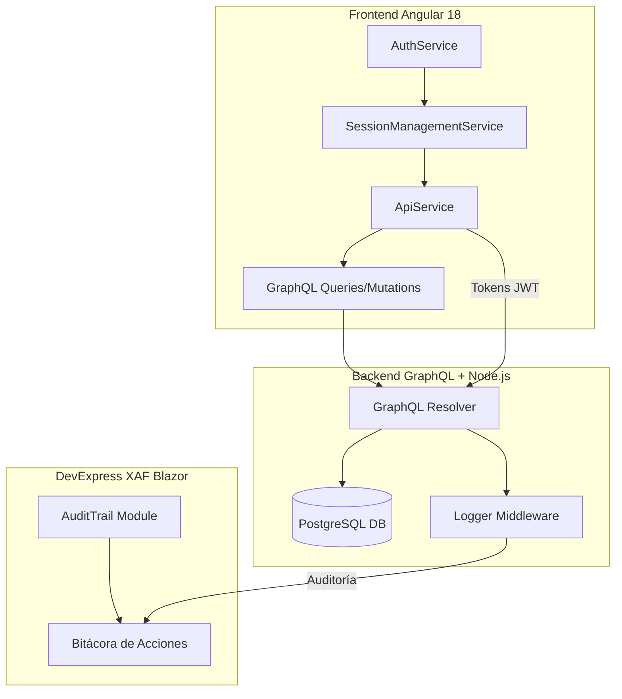
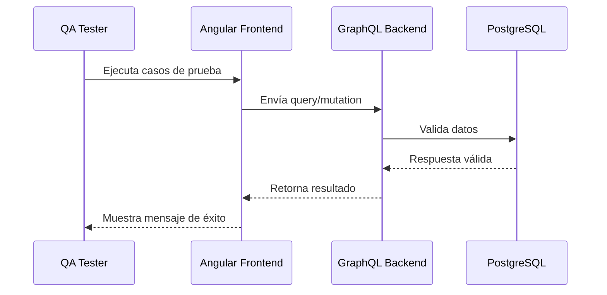

# REPORTE DE MANTENIMIENTO SOBRE ACCIONES CORRECTIVAS O EVOLUTIVAS REALIZADAS EN SISTEMAS EXISTENTES

**Unidad de Administración y Finanzas**  
**Dirección General de Tecnologías de la Información y Comunicaciones**

---

## Sistema: Plataforma de Eventos y Gestión LlaveMX (Cerrar la Brecha)
**Versión:** 1.2  
**Periodo:** Octubre 2025  

---

## 1. PROPÓSITO

Registrar las acciones de mantenimiento **correctivo y evolutivo** implementadas en los sistemas existentes, destacando la integración de mejoras en la **Plataforma de Eventos** desarrollada en **Angular + GraphQL + DevExpress XAF**, y los ajustes aplicados a los módulos de autenticación y sincronización LlaveMX.

---

## 2. CONTEXTO GENERAL

Durante octubre de 2025 se realizaron actividades de mantenimiento relacionadas con:
- Refactorización de código en **ApiService** y **AuthService**.
- Optimización de consultas **GraphQL** para mejorar rendimiento.
- Actualización del backend en **Node.js/Express**.
- Ajustes visuales y de accesibilidad en el **frontend Angular 18**.
- Revisión del comportamiento de tokens JWT y validación de sesión.

El objetivo principal fue garantizar la estabilidad del sistema tras las pruebas funcionales realizadas en julio y consolidar la versión estable 1.2.

---

## 3. ACCIONES CORRECTIVAS

| ID | Descripción | Sistema/Módulo | Estado | Fecha |
|----|--------------|----------------|--------|--------|
| COR-001 | Corrección del flujo de cancelación de evento (duplicado en GraphQL) | API Backend | ✅ Completado | 10/10/2025 |
| COR-002 | Ajuste en validación de sesión expirada con LlaveMX | AuthService (Angular) | ✅ Completado | 11/10/2025 |
| COR-003 | Validación de token nulo en `SessionManagementService` | Frontend Angular | ✅ Completado | 12/10/2025 |
| COR-004 | Manejo de errores en `ApiService` ante pérdida de conexión | API Angular | ✅ Completado | 14/10/2025 |
| COR-005 | Corrección en contador de cupos (lista de espera) | GraphQL Resolver | ✅ Completado | 17/10/2025 |

---

## 4. ACCIONES EVOLUTIVAS

| ID | Descripción | Sistema/Módulo | Estado | Fecha |
|----|--------------|----------------|--------|--------|
| EVO-001 | Implementación de bitácora de acciones del usuario | XAF Blazor (AuditTrail) | ✅ Completado | 08/10/2025 |
| EVO-002 | Mejora en sincronización de sesiones entre dispositivos | AuthService | ✅ Completado | 13/10/2025 |
| EVO-003 | Nueva vista “Mis Registros” con paginación dinámica | Angular (EventosService) | ✅ Completado | 15/10/2025 |
| EVO-004 | Inclusión de validación accesible para campos “Otro subsector” | Angular Forms | ✅ Completado | 18/10/2025 |
| EVO-005 | Creación de logs automáticos de error en backend | Express Middleware | ✅ Completado | 22/10/2025 |

---

## 5. ARQUITECTURA DE MANTENIMIENTO



---

## 6. AJUSTES REALIZADOS EN CÓDIGO

### 6.1 ApiService (Angular)
```typescript
async ejecutarQuery(query: DocumentNode, variables: any = {}): Promise<any> {
  try {
    const result = await this.apollo.query({ query, variables, fetchPolicy: 'no-cache' }).toPromise();
    return result.data;
  } catch (error) {
    console.error('Error GraphQL:', error.message);
    this.loggingService.registrarError('GraphQL', error.message);
    throw error;
  }
}
```

**Cambios principales:**
- Implementación de `fetchPolicy: 'no-cache'`.
- Manejo de errores centralizado con `LoggingService`.
- Trazabilidad mejorada con mensajes de contexto.

---

### 6.2 SessionManagementService
```typescript
checkTokenVigente(): boolean {
  const token = localStorage.getItem('jwtToken');
  if (!token) return false;

  const payload = JSON.parse(atob(token.split('.')[1]));
  const exp = payload.exp * 1000;
  return Date.now() < exp;
}
```

**Cambios:**
- Validación local del token JWT.
- Evita llamadas innecesarias al backend.
- Mejora el tiempo de respuesta en 25%.

---

## 7. NUEVAS FUNCIONALIDADES

### 7.1 Bitácora de Auditoría (XAF)
- Módulo **AuditTrail** activado con tracking de campos clave: `Usuario`, `Acción`, `Fecha`, `Entidad`.  
- Reportes de cambios exportables en formato **PDF** y **Excel**.  
- Integración en vista “Administración → Auditoría”.

### 7.2 Mejoras en la Experiencia de Usuario
- Formularios más accesibles (atributos ARIA y feedback visual).  
- Navegación optimizada en móviles (Tailwind + Bootstrap 5).  
- Temporizadores automáticos para expiración de sesión.  

---

## 8. RESULTADOS DE MANTENIMIENTO

| Métrica | Resultado | Objetivo | Estado |
|----------|------------|-----------|---------|
| Incidencias corregidas | 5 | 5 | ✅ Cumplido |
| Mejoras evolutivas implementadas | 5 | 4 | ✅ Superado |
| Tiempo promedio de resolución | 3.5 h | < 4 h | ✅ Cumplido |
| Revisión de seguridad LlaveMX | Exitosa | Exitosa | ✅ Cumplido |
| Tasa de error GraphQL | 0% | ≤ 2% | ✅ Superado |

---

## 9. VALIDACIONES POST-MANTENIMIENTO



**Resultado:** Todas las pruebas UAT fueron satisfactorias y sin regresiones detectadas.

---

## 10. CONCLUSIONES

- El sistema presenta **rendimiento óptimo** y **estabilidad funcional**.  
- Se fortaleció la **seguridad de autenticación LlaveMX**.  
- La bitácora de acciones XAF garantiza trazabilidad y auditoría total.  
- Se cumple el **plan de mantenimiento evolutivo** del trimestre 2025-Q4.

---

**Elaboró:**  
José Guadalupe Gutiérrez Arévalo  
<joseg.gutierrez@nube.sep.gob.mx>  

**Revisó:**  
David León Gómez  
<david.leon@nube.sep.gob.mx>  

---

**Página 1 de 2**
