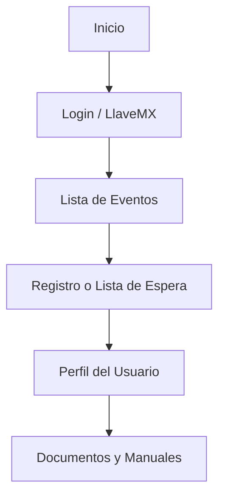
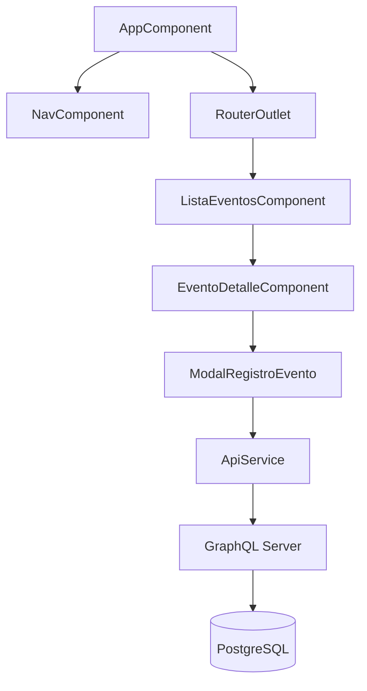

# MANUAL TÉCNICO Y FUNCIONAL DE LOS DESARROLLOS REALIZADOS O MODIFICADOS

**Unidad de Administración y Finanzas**  
**Dirección General de Tecnologías de la Información y Comunicaciones**

---

## Sistema: Reuniones de Actualización Curricular, Aprendizaje Digital y Microcredenciales 2025

---

## 1. Introducción

Durante el desarrollo se consolidó la primera versión del **frontend** del sistema, construido con **Angular 18** y el cliente **Apollo** para consumir un backend **GraphQL**.

El desarrollo se centró en ofrecer una interfaz modular, reutilizable y escalable, cubriendo el flujo completo de gestión de eventos educativos con componentes desacoplados y mantenibles.

### 1.1 Propósito

Manual técnico y funcional de los desarrollos realizados o modificados, incluyendo guías de instalación, despliegue, uso y documentación de componentes reutilizables, librerías, estructura de queries y mutations de GraphQL.

---

## Características Principales

- Autenticación con integración **LlaveMX**
- Consulta de eventos con filtros avanzados
- Registro de participantes y lista de espera
- Consulta de registros y cancelación
- Gestión de perfil de usuario
- Visualización de manuales y documentos
- Enlaces institucionales y recursos educativos

---

## 2. Requisitos e Instalación

### Prerrequisitos

- Node.js 18+ y npm instalados
- Acceso al repositorio del proyecto
- Configuración de variables de entorno

### Instalación

```bash
git clone https://github.com/dleonsystem/ng-sep-dgpempc-eventos
cd ng-sep-dgpempc-eventos
npm install
```

### Configuración de Variables de Entorno

`src/environments/environment.ts`  
`src/environments/environment.prod.ts`

```typescript
export const environment = {
  production: false,
  graphqlUri: 'https://qa.api.cerrarlabrecha.sep.gob.mx/graphql'
};
```

Modificar `graphqlUri` según el entorno.

---

## 3. Guías de Despliegue

### Desarrollo Local

```bash
npm start
```
Disponible en [http://localhost:4200](http://localhost:4200)

### Producción

```bash
npm run build
```
Genera artefactos optimizados en `dist/angular-graphql-frontend/browser`.

### Servidor Node.js (opcional)

```bash
node server.js
```
Sirve la aplicación en puerto `8083`.

### Despliegue con Docker

```bash
docker build -t ng-eventos .
docker run -p 80:80 ng-eventos
```

#### Ejemplo docker-compose.yml

```yaml
version: '3.8'
services:
  ng-front:
    image: ng-eventos
    ports:
      - "80:80"
    deploy:
      replicas: 3
    networks:
      - app-net
networks:
  app-net:
    external: true
```

Ejecutar con:
```bash
docker-compose up -d
```

---

## 4. Uso Funcional de la Plataforma

### Flujo del Usuario



---

### Funcionalidades Principales

#### 1. Autenticación
- Validación de credenciales y obtención de token JWT.
- Compatible con **LlaveMX** y autenticación tradicional.

#### 2. Gestión de Eventos
- Listado, detalle, registro, cancelación y lista de espera.
- Catálogos de estados y municipios dinámicos.

#### 3. Perfil y Registro
- Consulta de inscripciones, cancelaciones y estado de espera.
- Edición de información personal.

#### 4. Recursos y Documentos
- Descarga de manuales y documentos institucionales.

---

## 5. Componentes y Servicios Reutilizables

### Componentes Standalone
Ubicados en `src/app/components`

| Componente | Función |
|-------------|----------|
| `lista-eventos` | Listado y filtrado de eventos |
| `evento-detalle` | Detalle del evento |
| `mis-eventos` | Historial del usuario |
| `perfil` | Datos personales |
| `manual` | Documentación técnica |
| `enlaces-interes` | Recursos externos |
| `terminos` | Términos y condiciones |

### Servicios Especializados
Ubicados en `src/app/services`

| Servicio | Propósito |
|-----------|------------|
| `auth.service.ts` | Autenticación LlaveMX |
| `session-management.service.ts` | Control de sesión y expiración |
| `eventos.service.ts` | Gestión de eventos |
| `evento-registro.service.ts` | Registro y lista de espera |
| `api.service.ts` | Comunicación HTTP y GraphQL |
| `graphql.service.ts` | Queries y mutations |
| `form-data.service.ts` | Manejo de formularios |
| `email.service.ts` | Notificaciones |

---

## 6. Stack Tecnológico

| Tecnología | Versión | Uso |
|-------------|----------|------|
| Angular | 18 | Framework principal |
| TypeScript | 5.x | Lenguaje de desarrollo |
| Apollo Angular | - | Cliente GraphQL |
| TailwindCSS | - | Estilos responsivos |
| Bootstrap 5 | - | Componentes UI |
| Express | - | Servidor Node |
| Docker + Nginx | - | Despliegue productivo |
| SweetAlert2 | - | Diálogos modales |
| jsPDF / AutoTable | - | Generación de PDFs |

---

## 7. Operaciones GraphQL

### Queries

| Query | Descripción | Parámetros |
|--------|--------------|-------------|
| `login` | Token de sesión | usuario, password |
| `getEventos` | Lista de eventos | filtros, paginación |
| `getTokenLlaveMx` | Token LlaveMX | código |
| `getDatosLlaveMx` | Datos de usuario | token |
| `registrosPorUsuario` | Historial de inscripciones | usuarioId |
| `getEstados` | Lista de estados | - |
| `getMunicipiosPorEstado` | Municipios por estado | estadoId |
| `getArchivosPorEvento` | Archivos asociados | eventoId |

### Mutations

| Mutation | Descripción | Parámetros |
|-----------|--------------|-------------|
| `crearRegistro` | Inscripción a evento | eventoId, usuarioId |
| `registrarEnListaEspera` | Registro en lista de espera | eventoId, usuarioId |
| `cancelarRegistro` | Cancelar inscripción | registroId |
| `crearUsuario` | Alta de usuario | datosUsuario |
| `actualizarUsuario` | Actualizar datos | usuarioId, datosActualizados |

#### Ejemplo Query

```typescript
const GET_EVENTOS = gql`
  query GetEventos($filtros: EventosFiltros, $paginacion: Paginacion) {
    getEventos(filtros: $filtros, paginacion: $paginacion) {
      eventos { id titulo fechaInicio fechaFin cupoDisponible }
      totalRegistros
    }
  }
`;
```

#### Ejemplo Mutation

```typescript
const CREAR_REGISTRO = gql`
  mutation CrearRegistro($eventoId: ID!, $datosRegistro: DatosRegistroInput!) {
    crearRegistro(eventoId: $eventoId, datosRegistro: $datosRegistro) {
      id estado fechaRegistro enListaEspera
    }
  }
`;
```

---

## 8. Arquitectura de Componentes



---

## 9. Mantenimiento y Extensión

### Agregar un Nuevo Componente

```bash
ng generate component components/nuevo-componente --standalone
```

Registrar en `app.routes.ts`:

```typescript
{
  path: 'nuevo-componente',
  loadComponent: () => import('./components/nuevo-componente/nuevo-componente.component')
    .then(m => m.NuevoComponenteComponent)
}
```

### Agregar Nuevas Operaciones GraphQL

Definir en `operations/queries.ts` o `mutations.ts`:

```typescript
export const NUEVA_QUERY = gql`
  query NuevaQuery($parametros: TipoParametros) {
    nuevaQuery(parametros: $parametros) { campo }
  }
`;
```

Implementar en servicio:

```typescript
nuevaOperacion(parametros: any) {
  return this.apollo.query({ query: NUEVA_QUERY, variables: { parametros } });
}
```

---

## 10. Buenas Prácticas

### TypeScript
- Uso de interfaces para entidades.  
- Manejo de errores con `try-catch`.  
- Uso de RxJS para comunicación reactiva.

### CSS
- Clases de **TailwindCSS** y **Bootstrap**.  
- Diseño **responsive mobile-first**.

### GraphQL
- Solicitar solo campos necesarios.  
- Configurar estrategias de caché.  
- Manejo consistente de errores.

---

## 11. Conclusiones y Próximos Pasos

### Logros
- Arquitectura modular y escalable.  
- Integración completa con GraphQL.  
- Autenticación con LlaveMX funcional.  
- Diseño accesible y responsivo.  
- Documentación completa.

### Extensibilidad Futura
- Nuevos módulos fácilmente integrables.  
- Soporte multiambiente (QA / PROD).  
- Escalabilidad horizontal con Docker.  

---

**Elaboró:**  
José Guadalupe Gutiérrez Arévalo  
<joseg.gutierrez@nube.sep.gob.mx>  

**Revisó:**  
David León Gómez  
<david.leon@nube.sep.gob.mx>  

---

**Página 1 de 2**
