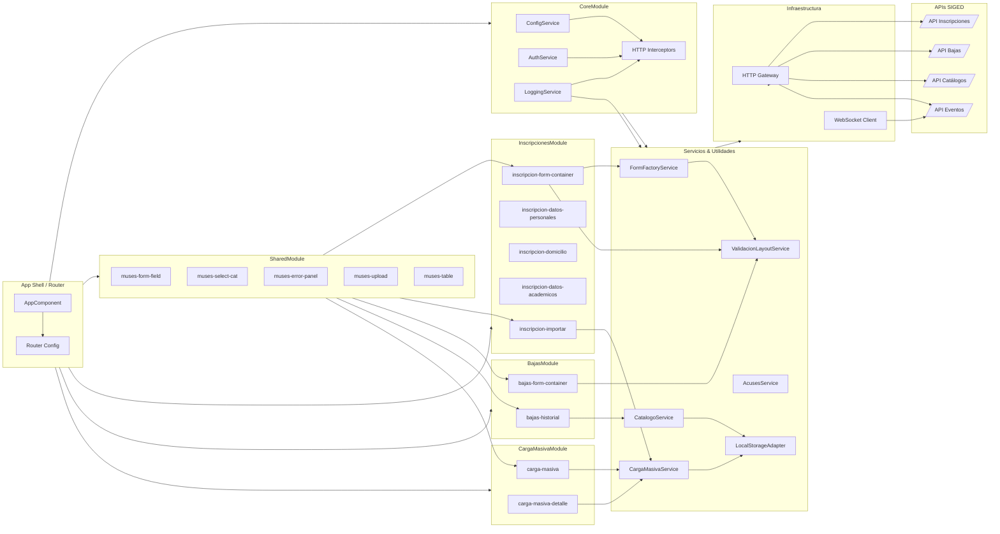

# Arquitectura propuesta para el front-end Angular de MUSES

## 1. Contexto y alcance
La plataforma MUSES expone flujos administrativos de inscripción, bajas, evaluaciones, certificaciones y actualización de catálogos en línea con el modelo nacional SIGED.【F:docs/casos_de_uso_siged.md†L1-L37】【F:docs/diagnostico_siged.md†L19-L84】 El front-end Angular ya implementa el flujo de inscripción masiva con lectura progresiva de CSV, almacenamiento local y navegación a un detalle de registros, y seguirá extendiéndose a los demás eventos descritos en los layouts oficiales.【F:bd/layout_V01.md†L1-L58】

La arquitectura se sustenta en:
- Una SPA Angular modular que prioriza _feature modules_ independientes.
- Integración con APIs de orquestación y validación, dejando al front-end únicamente la verificación estructural de archivos.
- Gestión de estado basada en Angular signals para manejo de progreso, filtros y persistencia local.
- Observabilidad, seguridad y estrategia de entrega continua compartidas con el ecosistema SIGED.

## 2. Principios arquitectónicos
1. **Modularidad de dominio**: cada evento administrativo se encapsula en un _feature module_. El módulo de Inscripciones contiene tanto la captura manual como la carga masiva y su vista de detalle.
2. **Componentes declarativos y reutilizables**: formularios, tablas y asistentes de carga aprovechan librerías de UI (Angular Material, CDK) y componentes _standalone_. El flujo de carga masiva reutiliza cabeceras descriptivas, tablas paginadas y modales reutilizables.
3. **Validación en origen focalizada**: el front-end valida la estructura mínima (encabezados requeridos, tipo de archivo) y delega las validaciones de negocio al back-end, tal como se definió con los usuarios de carga masiva.
4. **Estado reactivo con signals**: Angular signals administran progreso, filtros, cancelación y persistencia local de registros, evitando dependencias globales y facilitando pruebas.
5. **Interoperabilidad segura**: comunicación vía HTTPS con autenticación JWT/Keycloak y firma de eventos, alineada a la infraestructura propuesta para SIGED.【F:docs/diagnostico_siged.md†L103-L164】
6. **Documentación viva**: cada módulo incluye _README_, diccionarios de campos y casos de uso actualizados con las entregas recientes.

## 3. Capas lógicas
| Capa | Responsabilidades | Artefactos clave |
| --- | --- | --- |
| Presentación | Componentes Angular, rutas, guardas, internacionalización y accesibilidad. Incluye vistas de carga masiva, detalle y tablas filtrables. | `feature/*/components`, `app.routes.ts`. |
| Aplicación | Servicios de caso de uso, coordinadores de señales y validadores compartidos. | `feature/*/services`, `shared/state`. |
| Dominio | Modelos TypeScript, transformadores de CSV y mapeadores al layout SIGED. | `core/domain`, bibliotecas compartidas. |
| Infraestructura | Gateways HTTP, interceptores, manejo de errores, caching de catálogos y almacenamiento local. | `core/http`, `shared/data-access`. |

## 4. Módulos principales
- **CoreModule**: inicialización (configuración de entorno, interceptores, proveedores globales).
- **SharedModule**: componentes atómicos (inputs, selects, stepper, visor de errores) y pipes reutilizables.
- **Feature modules**:
  - `InscripcionesModule`: formulario dinámico, carga CSV con lectura por lotes, persistencia en `localStorage` y navegación a detalle por registro.
  - `BajasModule`: formulario condicionado por tipo y motivo de baja, integración con historial académico.
  - `EvaluacionesModule`: captura de parciales/finales, importación desde sistemas locales.
  - `CertificacionModule`: emisión y seguimiento de certificados digitales, consulta de folios.
- **AdminModule**: gestión de usuarios, roles, bitácoras y auditoría.

Cada módulo expone rutas hijas cargadas de forma diferida para optimizar tiempos de carga y facilitar despliegues parciales.

### 4.1 Diagrama de componentes
El siguiente diagrama resume los módulos y componentes front-end que colaboran para soportar los flujos de inscripción, baja y administración de catálogos descritos en el layout vigente. Puede visualizarse directamente en [Mermaid Chart](https://www.mermaidchart.com/) para inspeccionar relaciones o derivar vistas específicas.

## 5. Gestión de datos y catálogos
- **Modelos tipados**: interfaces TypeScript alineadas con los campos del layout (`Alumno`, `Trayectoria`, `Catálogo`).
- **Servicios de catálogos**: caching local con expiración configurable; sincronización con catálogos nacionales (CURP, CCT, carreras) mediante endpoints específicos.
- **Transformadores**: adaptadores para convertir formularios en payloads compatibles con las APIs y CSVs oficiales; en carga masiva convierten encabezados válidos en estructuras normalizadas para la tabla y el modal de detalle.
- **Bitácora de validaciones**: estructura común para registrar errores por campo. En carga masiva se registran progresos del servicio y se enlazan con filtros/paginación en la UI.
- **Persistencia local**: `localStorage` conserva el último lote procesado y su selección para permitir reanudaciones después de refrescar el navegador.

## 6. Integración con back-end y SIGED
- **APIs REST**: servicios `inscripciones`, `bajas`, `evaluaciones`, `certificaciones` y `catalogos` con endpoints versionados (`/api/v1`).
- **Seguridad**: interceptores añaden tokens JWT y manejan refresh; guardas de ruta validan permisos (RBAC).
- **Observabilidad**: servicio `LoggingService` envía eventos relevantes (fallos de validación, tiempos de procesamiento) a la plataforma de monitoreo.
- **Resiliencia**: reintentos exponenciales para catálogos, colas para cargas masivas (notificaciones de progreso por WebSocket).

## 7. Entornos y despliegue
- Configuraciones separadas (`environment.ts`) para _dev_, _qa_, _prod_ con variables de API y _feature flags_.
- _Pipeline_ CI/CD (GitHub Actions) que ejecuta lint, pruebas unitarias, pruebas de integración End-to-End (Playwright) y genera artefactos listos para CDN.
- Estrategia de despliegue _blue-green_ en hosting estático (S3 + CloudFront / Azure Static Web Apps) o contenedores Nginx.

## 8. Trazabilidad y documentación
- Documentar decisiones arquitectónicas con _ADR_ en `web/documentos/adr/` (nuevo directorio sugerido).
- Automatizar generación de diagramas (Structurizr DSL o PlantUML) para mantener consistencia.
- Mantener enlaces cruzados con los documentos de requisitos, casos de uso y layout para asegurar que los cambios en normativa disparen revisiones en código.

## 9. Próximas extensiones
- Implementar _micro frontends_ si otros equipos desarrollan módulos adicionales.
- Integrar analítica de uso para priorizar mejoras de UX.
- Incorporar mecanismos de _offline first_ para planteles con conectividad limitada, sincronizando cuando exista red disponible.
